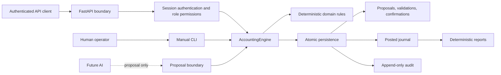

# Chatbooks Architecture

## Architecture contract

Chatbooks' accounting engine owns financial correctness. User interfaces and future AI components
may submit proposals and display verified results, but they may not implement accounting arithmetic
or write ledger records directly.

The current system is a typed Python accounting library, local command-line interface, and FastAPI
application boundary backed by SQLite. It is production-shaped for M3 but remains a single-host
service without a cloud deployment profile.



The dotted future-AI path ends at proposal creation. Human confirmation and posting must remain
outside model control.

## M3.5 product context

The current persistence and API architecture remains the implemented business boundary. A business
Financial Space maps to an existing organization; no current table or route is renamed or migrated.
A personal Financial Space will use a future personal ownership domain after its accounting and
privacy policies are approved. Financial Space is therefore a tagged application context in M3.5,
not a new cross-cutting database parent.

```mermaid
flowchart TB
    Experience[Chat-first client] --> Context{Financial Space}
    Context -->|BUSINESS + organization ID| CurrentAPI[Implemented M3 organization API]
    Context -. future .->|PERSONAL + personal-space ID| PersonalAPI[Future personal application boundary]
    CurrentAPI --> Engine[Existing deterministic accounting engine]
    PersonalAPI -. approved adapter later .-> Engine
    Engine --> Ledger[Space-isolated posted ledger]
```

Every future request, cache, conversation, budget, reminder, and AI tool call must carry the typed
space kind and ID. Business and personal records cannot be joined merely because they share a user.
No journal may span the two contexts. Future cross-space money movement requires separately
reviewable effects and an approved accounting treatment.

Budgets, reminders, recurring templates, goals, and conversations are future application-domain
records outside the journal. Their states cannot create, change, or imply posted actuals. Actual
financial values remain ledger-derived. See
[`docs/product-model.md`](docs/product-model.md) and ADRs
[`0009`](docs/decisions/0009-financial-space-context.md),
[`0010`](docs/decisions/0010-plans-schedules-ledger-separation.md), and
[`0011`](docs/decisions/0011-chat-first-progressive-disclosure.md).

## M5.0 personal domain direction

M5.0 defines future PERSONAL resolution without implementing it. A PERSONAL Financial Space resolves
to a stable `PersonalSpace` owned by one authenticated user in the initial model. It is private by
default and has no organization membership, project, or business-role semantics. BUSINESS continues
to resolve to the existing organization boundary.

Actual personal income, expense, transfers, liabilities, opening balances, corrections, balances,
and reports will use the deterministic proposal-to-ledger lifecycle. The current accounting rules
are reusable, but `AccountingEngine` and the schema currently embed `organization_id`. Future work
must introduce an internal owner-bound `LedgerBook` and an ownership-neutral ledger service behind
the existing business facade. It may refactor scope plumbing but may not weaken balance, atomicity,
confirmation, idempotency, reversal, immutability, or audit.

Personal account profiles and categories remain separate application objects mapped to ledger
accounts. Same-personal-space transfers are one balanced entry and are excluded from income/expense.
Personal/business movements create two independently confirmed effects linked by non-financial
correlation metadata. Their accounting treatment is an explicit accountant decision.

No executable or schema change is part of M5.0. See
[`docs/personal-finance-model.md`](docs/personal-finance-model.md) and ADRs
[`0013`](docs/decisions/0013-personal-ownership-isolation.md) through
[`0017`](docs/decisions/0017-personal-category-mapping.md).

## M5.1 universal financial core and current service seam

M5.1-A selects a phased convergence architecture without implementing it. A persistent internal
`LedgerBook` becomes the future canonical scope for accounts, periods, proposals, confirmations,
journal, financial audit, receipts, currency, and precision. Financial Space remains the typed
product/application context; an authenticated resolver maps a BUSINESS organization or PERSONAL
PersonalSpace to its book.

The existing `AccountingEngine` and organization routes are the business compatibility facade. The
facade now resolves an immutable BUSINESS `AuthorizedFinancialContext` and calls one
ownership-neutral deterministic financial service. A future personal adapter may call the same
service only after its ownership and accounting policies are approved. Facades own authorization,
terminology, and approved mappings; they do not own ledger rules or authoritative calculations.

Migration is staged: add and reconcile one book mapping per organization, extract the service seam,
construct book-scoped persistence with equivalent constraints, copy all existing identifiers and
immutable history, prove report/audit/idempotency parity, switch atomically, and enable personal
writes only afterward. Projects and organization documents remain business extensions. Tax,
VAT/GST, payroll compliance, statutory reporting, and filing remain outside the universal core.

M5.1-C1 implements the first additive seam. Schema v3 contains one immutable BUSINESS
`LedgerBook` for every organization, identified as `book:business:<organization_id>`, with matching
currency and precision. A membership-first internal resolver maps actor plus organization to that
book.

M5.1-C2 implements the service seam over the unchanged schema-v3 organization storage. The service
requires a server-created authorized context plus an explicit capability and owns accounts, periods,
proposal validation, exact-version confirmation, idempotent posting, reversal, ledger reads,
reports, and audit reads. Its repository protocol exposes typed, context-bound operations and no
generic SQL or raw connection. The SQLite adapter revalidates book/organization/currency/precision
before use. Existing charts, accounts, periods, proposals, confirmations, receipts, journals, audit,
and reports remain keyed by `organization_id`; no canonical book-scoped table or personal owner is
active.

M5.1-C3 implements schema-v4 canonical book-scoped persistence as a rehearsal target on disposable
database copies. `ledger_book_id` owns the reconstructed financial tables, and composite foreign
keys reject cross-book charts, accounts, periods, proposals, confirmations, receipts, journals,
lines, and reversals. Business project/document attribution lives in constrained extension tables.
Existing audit rows remain byte-for-byte unchanged; an immutable sidecar scopes every applicable
financial audit event to one book, and new financial audit triggers append both records atomically.
Legacy fingerprints remain tagged `organization-v1` and are verified with the exact legacy payload.

The normal `Database`, CLI startup, and FastAPI startup remain schema v3 for C3. Schema v4 opens only
through the explicit canonical-rehearsal engine/application path. C3 does not migrate the shared
database, resume ordinary writers on v4, add a PERSONAL owner, or perform the C4 cutover.

M5.1-C4A adds a synthetic-only operational harness around those unchanged boundaries. It generates
its own representative v3 fixture, proves writer exclusion and verified backup/restore, measures
reconstruction and capacity, compares v3/v4 engine/API/CLI reads exactly, runs one controlled canary
on a disposable v4 clone, and exercises all rollback branches. The command cannot accept an
existing database. Normal application selection remains v3 and C4 remains separately authorized.

M5.2-A adds policy only. It narrows the future personal MVP to Checking, Savings, Cash, Credit Card,
Personal Loan, explicit income/expense categories, same-space transfers, basic liability reduction,
and ledger-derived Balances, Activity, Income, Spending, Category Spending, and Cash Position. A
future personal adapter remains the only presentation-to-ledger translation boundary and must fail
closed when period, default mapping, opening-balance, liability, cash-position, or cross-space policy
has not been approved. No PersonalSpace, schema, API, UI, or executable behavior is added.

See [`docs/personal-finance-model.md`](docs/personal-finance-model.md) for the operation semantics,
decision classifications, and implementation gates.

The option comparison, decision classifications, and remaining migration gates are in
[`docs/universal-financial-core.md`](docs/universal-financial-core.md) and ADRs 0018–0020.

## Module boundaries

| Module                                    | Responsibility                                                                                                      | Boundary                                                                                                               |
| ----------------------------------------- | ------------------------------------------------------------------------------------------------------------------- | ---------------------------------------------------------------------------------------------------------------------- |
| `chatbook/domain.py`                      | Immutable values, exact amounts, dates, account/project enums, balanced-line validation                             | No SQL, UI, prompts, or external services                                                                              |
| `chatbook/engine.py`                      | BUSINESS compatibility facade, membership/context resolution, business extensions, and stable public result shaping | No independent financial lifecycle, report arithmetic, authentication provider, LLM logic, or inferred classifications |
| `chatbook/financial/context.py`           | Immutable authorized Financial Space, book, capability, currency, precision, and provenance values                  | No client-created authority or storage access                                                                          |
| `chatbook/financial/commands.py`          | Typed account, period, proposal, confirmation, posting, reversal, and report inputs                                 | No SQL or implicit accounting classification                                                                           |
| `chatbook/financial/service.py`           | Single deterministic financial lifecycle, exact calculations, reversal, audit, and receipt orchestration            | Requires authorized context; no owner policy, product labels, raw SQL, or raw connection                               |
| `chatbook/financial/repository.py`        | Explicit context-bound repository and unit-of-work protocols                                                        | No generic query/execute escape hatch                                                                                  |
| `chatbook/financial/business.py`          | Membership-first BUSINESS context resolution                                                                        | No client book authority or PERSONAL fallback                                                                          |
| `chatbook/storage/sqlite_organization.py` | Temporary schema-v3 organization storage adapter for the universal service                                          | No canonical v4 scope, personal owner, or exposed connection                                                           |
| `chatbook/storage/sqlite_book.py`         | Canonical schema-v4 book-scoped repository used by disposable rehearsal copies                                      | Named repository operations only; no raw connection, generic SQL, or PERSONAL owner                                    |
| `chatbook/database.py`                    | Connection policy, schema initialization, atomic writes, and automatic audit triggers                               | No business intent or accounting interpretation                                                                        |
| `chatbook/canonical_database.py`          | Explicit v4 rehearsal connection, book write context, audit authorizer, and atomic writes                           | Refuses non-v4/in-memory databases and is not used by normal startup                                                   |
| `chatbook/canonical_migration.py`         | Verified-backup v3-to-v4 reconstruction, reconciliation, failure evidence, and query-plan measurements              | Disposable targets only; no live cutover or writer resumption                                                          |
| `chatbook/cutover_readiness.py`           | Synthetic representative fixture, writer/backup/restore proof, parity, capacity, canary, and recovery drills        | Existing databases, live cutover, deployment selection, ordinary v4 writers, or accounting policy                      |
| `chatbook/canonical_schema.py`            | Canonical v4 constraints, indexes, lifecycle guards, legacy-shaped audit triggers, and sidecar rules                | No application authorization or accounting-policy invention                                                            |
| `chatbook/migration_evidence.py`          | Read-only v2/v3 integrity manifests and SQLite-consistent backup/restore proof                                      | No repair, financial mutation, plaintext financial payload logging, or accounting authority                            |
| `chatbook/ledger_books.py`                | Membership-first BUSINESS organization-to-book resolution                                                           | No client book authority, personal owner, or financial write logic                                                     |
| `chatbook/fingerprints.py`                | Existing canonical proposal-fingerprint serialization reused by validation and preflight                            | No posting or storage behavior                                                                                         |
| `chatbook/schema_contract.py`             | Stable audited/v2 table lists and deterministic BUSINESS book IDs                                                   | No authorization or accounting behavior                                                                                |
| `chatbook/schema.sql`                     | Strict relational model, ownership constraints, posting guards, immutability, and indexes                           | No conversation state or model output                                                                                  |
| `chatbook/cli.py`                         | Manual input, proposal review, explicit confirmation, and JSON presentation                                         | No financial arithmetic or direct ledger SQL                                                                           |
| `chatbook/auth.py`                        | Scrypt credentials and opaque bearer sessions                                                                       | No accounting or organization permission rules                                                                         |
| `chatbook/permissions.py`                 | Explicit organization roles and permissions                                                                         | No authentication or accounting calculations                                                                           |
| `chatbook/api/`                           | Typed HTTP routes, authenticated actors, role checks, errors, pagination, logging                                   | No SQL, ledger arithmetic, or client-supplied actor trust                                                              |
| Future personal application boundary      | Personal ownership, authorization, account/category mapping, and personal read models                               | No fake organization, independent ledger arithmetic, or cross-space journal                                            |
| Future PERSONAL resolver/adapter          | PERSONAL resolution into the existing authorized-context/service boundary                                           | No client-selected LedgerBook authority or policy defaults                                                             |
| Future ledger-book persistence            | Book-scoped financial tables, foreign keys, triggers, audit, and receipts                                           | No planning actuals, tax, payroll, or statutory policy                                                                 |
| `tests/`                                  | Invariant, lifecycle, persistence, concurrency, failure, and CLI acceptance evidence                                | No production data                                                                                                     |

The detailed implementation narrative remains in
[`docs/architecture.md`](docs/architecture.md), while major choices are recorded under
[`docs/decisions/`](docs/decisions/README.md).

## Persistence model

Normal C3 application operation remains on schema v3, where organizations own financial rows and
each organization has one immutable BUSINESS LedgerBook mapping. Disposable schema-v4 rehearsal
copies make that LedgerBook the canonical owner of financial rows. Users, organizations,
memberships, projects, and documents retain their existing identities; project/document financial
links move to business extension tables constrained to the book's exact organization. Composite
foreign keys reject cross-book references in v4 just as organization composite keys do in v3.

The write-side financial records are deliberately separated:

```text
transactions + transaction_lines
        │
        ├── validations (proposal fingerprint)
        │       │
        │       └── confirmations (actor acceptance)
        │               │
        │               └── journal_entries + journal_lines (posted truth)
        │
        └── optional reversal target
```

Proposal records become immutable after assembly. Journal entries are assembled inside an
uncommitted write transaction, checked by database triggers, and exposed to ledger queries only
after the state transition to `posted`.

## Transaction and consistency model

Every mutation uses a short `BEGIN IMMEDIATE` transaction. This serializes competing writers before
the engine checks mutable conditions such as period locks and account activity. The proposal or
journal records and their audit events commit together. Any exception rolls back the entire write.
Concurrent posting, reversal, and period-lock operations therefore resolve in a serial order: either
the financial post commits before the lock, or the lock commits and the post is rejected.

Posting uses layered validation:

1. Domain validation checks exact line values and balance.
2. The application checks membership, current period, active accounts, fingerprint, confirmation,
   duplicate posting, and reversal state.
3. Database constraints and triggers recheck ownership, shape, balance, period, exact proposal
   equality, confirmation linkage, reversal equality, and immutable transitions.

Ledger and report queries select only `posted` entries. Balances are derived at read time with Python
integers; there is no editable or authoritative balance cache.

## Audit architecture

The database creates audit events automatically for supported inserts and updates using actor and
request context supplied by the application transaction. Audit history, proposals, validations,
confirmations, and posted entries reject update, delete, and replacement operations. Audit provides
application-level traceability, not cryptographic protection from a machine administrator.
The supported application connection also rejects direct audit-event inserts; only the installed
audit triggers may append events.

## Security boundary

The API derives actor identity from an expiring opaque bearer session and checks explicit
organization permissions. Passwords use salted scrypt hashes and stored tokens use SHA-256 hashes.
The CLI remains a trusted local interface. Filesystem administrators remain inside the trust boundary,
and TLS, encryption at rest, rate limiting, MFA, recovery, backup, and production operational controls
remain deployment work. See [`docs/security.md`](docs/security.md).

## Evolution rules

- Read [`rules.md`](rules.md) before every task.
- Keep proposals, confirmations, and posted journals as separate concepts.
- Put new accounting behavior in deterministic domain/application code and database constraints.
- Add invariant and failure-path tests with every financial behavior change.
- Document ambiguous business rules instead of encoding assumptions.
- Add migrations for schema changes; never reset or silently reinterpret existing ledgers.
- Record major boundary, persistence, or consistency changes as ADRs.

A production database migration must reproduce these guarantees with database constraints, unique
indexes, transaction isolation or row locking, and concurrency tests. SQLite's single-writer lock is
part of the current consistency model and must not be assumed to exist in another database.
