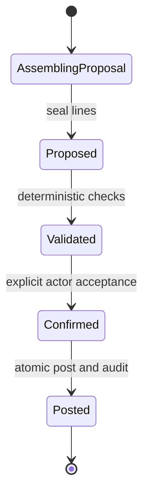
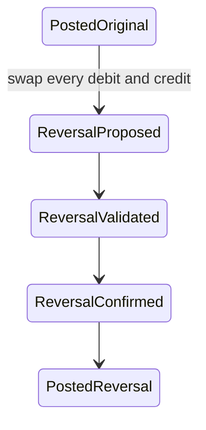

# Chatbooks Design

## Design goals

The foundation is designed so that accounting correctness does not depend on natural-language
interpretation, a user interface, or an LLM. It favors explicit records, exact values, guarded state
transitions, and redundant enforcement at the application and database layers.
Chatbooks should expose complexity on demand, not complexity by default.
M4 implements the first customer-facing shell over the business-organization API. Personal finance
persistence, budgets, reminders, conversation storage, and AI remain planned capabilities. M5.0
defines the personal domain and integration design without implementing those capabilities. M5.1-A
defines the shared jurisdiction-neutral financial core, persistent ownership seam, adapter
boundaries, and migration strategy. M5.2-A defines the smallest personal-finance product and policy
boundary without adding executable behavior.

## Product experience design

The primary product question is “What do you want to do with your money?” Conversation is the front
door, supported by a visible Personal/Business context and structured financial actions. Chat is a
product interaction model rather than permission to turn free text into ledger writes.

The implemented M4 navigation is:

| Surface  | Design purpose                                                    |
| -------- | ----------------------------------------------------------------- |
| Chat     | Default entry, questions, and structured action flow              |
| Money    | Accounts, balances, detailed activity, and later budgets          |
| Projects | Business-only project context and ledger-derived actuals          |
| Reports  | Accessible summaries with optional accounting depth               |
| Activity | Chronological proposals, postings, reversals, and later reminders |

Personal/Business context switching sits above these surfaces. Projects is absent in personal
context. A separate Home/Today view is deferred until attention signals, budgets, and reminders make
it distinct from Chat.

Progressive disclosure presents the same verified event in layers: plain-language money activity,
category and account detail, debit/credit mapping, then complete proposal-to-audit provenance. The
default view must still show context, amount, currency, date, state, and confirmation consequence.

Chatbooks may use established conversation conventions such as a chronological stream, composer,
suggested prompts, keyboard submission, visible processing, and history. It must develop its own
brand, layout, financial action cards, state treatment, typography, color, iconography, and voice
rather than copying ChatGPT's visual system or exact interaction details. The complete principles are
in [`docs/product-model.md`](docs/product-model.md#ux-principles).

## Financial Space design direction

M3.5 treats Financial Space as a tagged application reference with kind `PERSONAL` or `BUSINESS`.
BUSINESS maps to the existing organization boundary. PERSONAL requires a future personal ownership
domain. It is not implemented as an ordinary organization and does not require a current ledger
migration.

Every future action card, report, conversation, budget, reminder, cache, and tool call must retain
the space kind and ID. No journal spans spaces. Plans and schedules remain outside the ledger, and
their displayed actuals are calculated from posted activity through approved mappings.

## Personal domain design direction

The future PERSONAL reference resolves to `PersonalSpace.id`. The initial aggregate has one
authenticated owner and is private by default; organization membership and roles confer no personal
authority. The client keeps the kind and ID visible, while the backend independently resolves and
authorizes them for every request.

Personal account profiles present cash, checking, savings, credit-card, loan, and installment
concepts and map to owned asset/liability ledger accounts. They never store authoritative balances.
Personal categories are separate stable labels with versioned income/expense account mappings.
Proposals retain the selected category/mapping provenance; later renames or remaps do not rewrite
posted history.

Actual personal activity follows the existing guarded lifecycle. Future implementation introduces a
typed personal adapter and internal owner-bound ledger book behind an ownership-neutral deterministic
service. The existing organization engine remains a compatibility facade. No fake organization,
parallel mutable transaction store, or copied/weaker accounting engine is allowed.

Same-space transfers create one balanced non-income/expense entry. Personal/business movements
create two independent proposals and posts linked by a non-financial correlation. Opening balances
are proposal batches with provenance and reversal/replacement corrections. Liability payments are
explicit transfers; interest and principal are never calculated or inferred without approved rules.

Default personal reports are balances, money activity, spending, income, categories, and an approved
cash position. Net worth and investment valuation remain deferred. The full model is in
[`docs/personal-finance-model.md`](docs/personal-finance-model.md).

## Simplified personal MVP design

The M5.2-A personal experience uses five account concepts: Checking, Savings, Cash, Credit Card, and
Personal Loan. It uses starter income and expense categories plus user-created categories. The
default information hierarchy is:

1. plain-language activity, amount, account, category, and date;
2. whether the item is income, spending, transfer, card activity, loan payment, or reversal;
3. proposal status and confirmation consequence; and
4. ledger lines, mapping version, actor, timestamps, and audit evidence on demand.

Income and spending flows are available only when an approved category mapping can produce explicit
ledger lines. A same-space Checking-to-Savings movement appears once as a transfer and never as
income or spending. A card payment reduces money held and money owed without duplicating the
original purchase in spending. A loan payment accepts an explicit principal amount and never guesses
interest, fees, penalties, tax, or amortization.

Opening balances are a gated onboarding step. The UI may collect an asserted balance, date, and
source only after it can disclose that the value is not an actual until an approved balanced
proposal is confirmed and posted. It must not invent an offset. Personal period controls remain out
of normal navigation, but the deterministic period check remains active and posting is unavailable
until its policy is approved.

Balances, Activity, Income, Spending, Category Spending, and Cash Position are read models over
posted data. Budgets and reminders may later reference personal accounts/categories but never change
actuals. Investments, net-worth valuation, household sharing, multi-currency, automatic financial
posting, tax, and compliance are outside this MVP. The full policy is in
[`docs/M5_2_PERSONAL_FINANCE_MVP_POLICY.md`](docs/M5_2_PERSONAL_FINANCE_MVP_POLICY.md).

## Universal core design direction

The selected target uses a persisted internal `LedgerBook` as the canonical financial scope and a
server-issued `AuthorizedFinancialContext` as the call boundary. A typed Financial Space resolver
authorizes the session actor against Organization membership/roles or PersonalSpace ownership before
mapping to the book. Client-selected book IDs are never authority.

The existing accounting engine and organization API are the implemented BUSINESS compatibility
facade. A future
personal adapter maps approved presentation accounts and versioned categories to explicit lines.
Both call one deterministic service for validation, confirmation, posting, reversal, balances,
financial audit, and receipts. Financial Activity is command/read-model vocabulary, not a second
posted entity.

Migration is phased rather than a one-step table replacement: add book mappings, extract the service
seam, create equivalent book-scoped constraints, copy identifiers and immutable history, reconcile
all business results, cut over atomically, and only then enable personal writes. The full design and
option comparison are in
[`docs/universal-financial-core.md`](docs/universal-financial-core.md).

M5.1-C1 implements the first phase. Schema v3 contains the immutable one-to-one BUSINESS book
mapping and a membership-first internal resolver. Preflight, SQLite backup/restore proof, and exact
legacy-table hash comparison guard v2 migration. M5.1-C2 implements the authorized context,
deterministic universal service, typed repository boundary, temporary organization storage adapter,
and BUSINESS facade. Every financial table, application contract, and report remains organization-
scoped; canonical book-scoped persistence and the personal adapter are still future.

Tax, VAT/GST, payroll compliance, statutory reports, filing, and jurisdiction-specific calculations
are outside the universal core. A future external policy layer can consume versioned core results
and create ordinary proposals, but cannot write journal or audit data directly.

## Core domain values

| Value          | Representation                                                       | Rule                                                       |
| -------------- | -------------------------------------------------------------------- | ---------------------------------------------------------- |
| Money          | Integer minor units                                                  | Nonnegative, bounded per line, never binary floating point |
| Currency       | Current organization-level, future ledger-book-level uppercase label | One currency and fixed precision per financial book        |
| Date           | Canonical `YYYY-MM-DD` calendar date                                 | Used for periods and financial reporting                   |
| Account type   | Asset, liability, equity, revenue, expense                           | Selected explicitly; no inferred classifications           |
| Project status | Planned, active, completed, cancelled                                | Planning metadata; does not control posting                |
| Line           | Account, debit, credit, optional project                             | Exactly one positive side                                  |
| Validation     | Proposal ID, fingerprint, totals                                     | Immutable evidence of deterministic validation             |
| Confirmation   | Validation ID and actor                                              | Immutable explicit acceptance                              |

The domain uses immutable dataclasses and string enums. Expected failures use `ChatbookError` with a
stable code and readable message.

## State design

### Forward transaction

`Validated` and `Confirmed` are immutable records rather than mutable transaction flags. A proposal
can have multiple validations or confirmations for auditability, but its unique journal reference
allows only one successful posting. Reusing the same successful confirmation is idempotent.

### Reversal

The original never changes. The posted reversal contains a `reverses_entry_id`, retains project
dimensions and line positions, and must exactly offset the target entry.

## Posting algorithm

Inside one serialized write transaction, the engine:

1. verifies actor membership and loads the confirmation, validation, and immutable proposal;
2. returns the existing journal entry for an idempotent retry using the same confirmation;
3. recomputes the proposal fingerprint and double-entry totals;
4. verifies active accounts, organization ownership, open period, and reversal conditions;
5. creates an internal assembling journal header and copies the ordered proposal lines;
6. transitions the journal to `posted`, invoking database aggregate and equality guards; and
7. commits the journal and automatically generated audit events together.

Any failure rolls back the header, lines, state transition, and audit events. Ledger readers filter
for `posted`, so incomplete internal assembly cannot affect balances.

## Database defenses

SQLite STRICT tables and checks constrain dates, enums, amounts, line sides, JSON audit snapshots,
and state values. Composite foreign keys enforce organization ownership. Unique constraints protect
one account code per organization, one journal per proposal, one confirmation per posted journal,
and one direct posted reversal per target.

Triggers enforce:

- nonoverlapping accounting periods;
- proposal and journal initial states;
- sealed proposal lines and immutable posted lines;
- valid one-way state transitions;
- open-period posting;
- current actor/confirmation linkage;
- at least two lines and exact aggregate debit/credit equality;
- exact proposal-to-journal line equality;
- exact reversal line equality;
- immutable audit events; and
- append-only or narrowly allowed updates for financial/master records.

The application repeats important checks to return clear domain errors before relying on a database
rejection. The database remains the final defense against invalid persistent state.

The application connection authorizer permits audit-event inserts only when they originate from the
known audit triggers. This prevents callers with accidental access to the private connection from
forging audit rows through that connection. It does not protect against an operating-system or
database administrator who replaces the database or uses a different client.

## Concurrency and idempotency

SQLite `BEGIN IMMEDIATE` serializes every write before mutable posting conditions are read. Competing
posts, reversals, and period locks therefore observe a serial order. Unique proposal and reversal
constraints provide a second database-level defense. A retry using the same confirmation returns the
existing entry without another ledger or audit mutation.

The kernel cannot distinguish a network retry from a genuinely repeated business event when the
caller creates a new proposal with a new identifier. Comparing payloads is unsafe because two real
transactions may have identical dates, descriptions, accounts, and amounts. The API binds a
caller-supplied idempotency key to confirmation and posting requests and replays the stored result.
Proposal and reversal-proposal creation idempotency remains deferred.

## Reports

Ledger queries return posted lines ordered by accounting date, entry, and line position. Optional
as-of, start-date, and project filters apply to posted data only. Report totals use Python integers.

- Account balance: debits minus credits.
- Trial balance: positive net debits and net credits presented separately.
- Income statement: revenue credits less debits, minus expense debits less credits, for an inclusive
  date range.
- Balance sheet: assets, liabilities, recorded equity, and cumulative unclosed earnings as of a date.

The basic statements are deterministic summaries and do not encode tax, recognition, closing, or
jurisdictional presentation rules. A project-filtered trial balance can be unbalanced because tags
apply to individual lines; the full organization ledger must always balance.

## Manual interface

The CLI accepts trusted local actor and organization identifiers and returns JSON. Proposal files
contain an accounting date, description, optional document ID, and ordered lines using integer minor
units. `show` presents the proposal. `validate` returns immutable validation evidence. `confirm`
displays the proposal and requires an exact confirmation phrase unless a human-operated noninteractive
caller explicitly passes `--accept`. `post` requires the resulting confirmation ID.

The CLI is an evaluation and local operations interface. It is not an authentication or production
authorization boundary, and its confirmation flag must never be exposed as an LLM tool.

## API interface

FastAPI routes accept typed Pydantic models and return stable JSON errors carrying a request ID.
Bearer authentication resolves the actor; organization roles resolve permissions. No request body
contains a trusted actor ID. Each organization route calls a public engine method, and no API route
receives the private database wrapper or connection.

The API reflects the existing proposal lifecycle instead of storing a duplicate state machine:
`PROPOSED`, `VALIDATED`, `CONFIRMED`, and `POSTED` are derived from immutable proposal, validation,
confirmation, and journal records. Current proposals are immutable version 1. Confirmation writes
the version, authenticated actor, UTC timestamp, and caller request identifier atomically.

Confirmation and posting require a caller idempotency key. The engine stores a scoped immutable
key/request-fingerprint/result receipt in the same transaction as the mutation. Equal retries return
the first result; conflicting key reuse fails. Payload equality never deduplicates business events.

Passwords use salted scrypt hashes. Login returns a random opaque bearer token while storage retains
only its SHA-256 hash. Sessions expire after eight hours by default and logout revokes them. The M3
role matrix is centralized in `chatbook/permissions.py`.

## Future AI design boundary

A future AI layer may turn untrusted language or document-derived values into a proposal, ask for
clarification, and explain verified reports. It must use the same proposal schema as manual input.
It may not receive the confirmation or posting capability, database access, or authority to choose
an actor. All amounts and reports shown as accounting results must come from deterministic engine
validation and ledger calculations. See [`docs/ai-behavior.md`](docs/ai-behavior.md).

## Known design limits

The system is single-host and single-currency. API actors are authenticated; CLI actor IDs remain
trusted local inputs. It does not include TLS/deployment infrastructure, encryption at rest, MFA,
password recovery, login throttling, credential migration for legacy users, role changes/removal,
ownership transfer, backups, period reopening, partial reversals, proposal amendment, document
content handling, or jurisdiction-specific accounting rules. Account hierarchy and classified cash
flows are not modeled. Personal ownership and activity, space discovery, general budgets, financial
reminders, recurrence, categories, goals, conversation storage, and AI are also not
modeled. These limits remain until requirements are approved.
