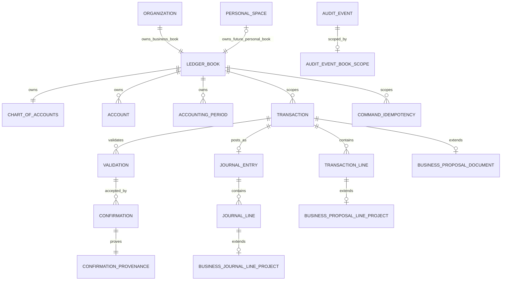

# M5.1-B universal financial core implementation plan

**Date:** 2026-09-27  
**Milestone:** Planning and implementation design only  
**Project and product:** Chatbooks
**Status:** Complete plan; Phases 1–6 rehearsed by M5.1-C1/C2/C3/C4A, cutover deferred

## Purpose and stop boundary

This plan turns the accepted M5.1-A architecture into a sequence of separately releasable coding
milestones. M5.1-C1 separately authorized and completed Phase 1 and Phase 2; M5.1-C2 separately
authorized and completed Phase 3 and the business-facade compatibility work in Phase 4. The current
organization-scoped schema-v3 business system remains the running system and the complete existing
behavior remains the compatibility baseline. M5.1-C3 implements Phase 5 only on disposable restored
copies. M5.1-C4A implements Phase 6 with synthetic operational evidence, cutover and recovery
documentation, and deployment-specific blockers. Cutover and later phases still require separate
authorization.

The target is one deterministic financial service and one book-scoped persistence model serving
business books first and personal books later. The implementation may refactor ownership plumbing,
but it may not change double-entry rules, exact money, proposal review, exact-version confirmation,
atomic posting, compensating reversal, period enforcement, immutable history, audit provenance,
idempotency, project integrity, or report arithmetic.

This plan follows [ADR 0018](decisions/0018-persistent-ledger-book-seam.md),
[ADR 0019](decisions/0019-authorized-context-and-adapters.md), and
[ADR 0020](decisions/0020-jurisdiction-compliance-outside-core.md). No additional architecture ADR
is required: the repository review found implementation details to resolve, not a missing major
decision.

## Repository findings that shape the plan

- Before C2, `AccountingEngine` combined organization membership checks, application workflow,
  direct SQLite queries, posting, reversal, reporting, audit reads, and idempotency. C2 retains its
  public surface as a BUSINESS facade while moving financial behavior into the universal service.
- `Database` owns one connection, `BEGIN IMMEDIATE`, migration initialization, transaction audit
  context, dynamic audit triggers, and the audit-insert authorizer.
- Every financial table and most financial queries use `organization_id`. Composite foreign keys
  currently prevent cross-organization references.
- The API checks role permissions, then calls the public `AccountingEngine`; the CLI trusts a local
  actor ID and gives any organization member the engine's current capabilities.
- Proposal validation fingerprints include the current physical transaction row plus ordered account,
  amount, and project values. A storage refactor must still verify old fingerprints.
- Audit state JSON is generated from physical table columns. Existing audit JSON, sequence numbers,
  timestamps, actors, request metadata, and entity IDs must not be regenerated.
- `command_idempotency` is scoped by organization, actor, operation, and caller key. Its stored request
  fingerprint and resource result are immutable retry evidence.
- SQLite `BEGIN IMMEDIATE` serializes current writers. A migration cannot assume concurrent writers,
  zero downtime, or a database-independent lock model.
- The current migration runner executes SQL resources within one initialization transaction. The
  canonical-table migration will need an explicit orchestration step for preflight, copy,
  reconciliation, and fail-closed cutover.
- The current runtime schema is version 3. The repository database is useful as an empty/current
  schema case, not representative canonical-migration evidence.

## Final target architecture

```text
Authenticated client
  → existing organization API | future personal API
  → FinancialSpaceResolver
      BUSINESS + Organization.id → membership/role → LedgerBook
      PERSONAL + PersonalSpace.id → owner/grant → LedgerBook
  → AuthorizedFinancialContext
  → BusinessAccountingFacade | future PersonalAccountingAdapter
  → UniversalFinancialService
      accounts and periods
      proposals, validation, confirmation, posting
      reversal
      balances and deterministic report primitives
      audit and idempotent command results
  → FinancialRepository / UnitOfWork
  → SQLite book-scoped constraints and immutable audit
```

The universal service is the exclusive financial write and calculation boundary. Routes, facades,
and adapters may authenticate, authorize, resolve a typed Financial Space, select approved mappings,
construct commands, and shape responses. They may not write journal rows, calculate authoritative
totals, bypass validation or confirmation, or create another ledger implementation.

### Authorized context

The internal context is immutable and is created only after authentication and owner authorization:

```text
AuthorizedFinancialContext
├── actor_id
├── FinancialSpaceRef(kind, owner_id)
├── ledger_book_id
├── currency and minor_unit_digits
├── resolved capabilities
├── request_id
├── authority_source: API_ROLE | TRUSTED_LOCAL_COMPATIBILITY
└── optional BUSINESS organization_id and project scope
```

Public APIs never accept `ledger_book_id` as authority. The compatibility source preserves the
current trusted local CLI behavior and must never be exposed as a network or AI capability.

## Module and service boundaries

Module names below are the implementation target. Existing imports stay valid during extraction.

| Module                                    | Responsibility                                                                                          | Migration treatment                                                      |
| ----------------------------------------- | ------------------------------------------------------------------------------------------------------- | ------------------------------------------------------------------------ |
| `chatbook/domain.py`                      | Existing exact money, dates, line values, enums, balance values                                         | Keep public imports stable; move no behavior merely for packaging        |
| `chatbook/financial/context.py`           | `FinancialSpaceRef`, book ID, capabilities, `AuthorizedFinancialContext`                                | Add first; no SQL or client trust                                        |
| `chatbook/financial/commands.py`          | Typed account, period, proposal, confirmation, posting, reversal, and report queries                    | Add incrementally; no accounting defaults                                |
| `chatbook/financial/service.py`           | Deterministic lifecycle, current-state checks, reversal, report arithmetic, audit/receipt orchestration | Extract one operation family at a time from `AccountingEngine`           |
| `chatbook/financial/repository.py`        | Explicit repository and unit-of-work protocols with typed records                                       | No generic SQL escape hatch or public connection                         |
| `chatbook/storage/sqlite_organization.py` | Temporary v3 adapter over existing organization-scoped tables                                           | Used only during service extraction and business parity work             |
| `chatbook/storage/sqlite_book.py`         | Final book-scoped repository and transaction implementation                                             | Enabled only after v4 migration parity passes                            |
| `chatbook/financial/business.py`          | Organization authorization/resolution and legacy result shaping                                         | Becomes the internals of the `AccountingEngine` facade                   |
| `chatbook/engine.py`                      | Stable public `AccountingEngine` facade                                                                 | Keep method names, arguments, errors, and result shapes compatible       |
| `chatbook/database.py`                    | Connection policy, schema-version orchestration, transaction/audit session context                      | Add book context and migration checkpoints; do not expose raw connection |
| `chatbook/api/`                           | Existing authentication, roles, HTTP contracts, pagination, and routes                                  | Keep organization routes and OpenAPI stable during core migration        |
| `chatbook/permissions.py`                 | Existing organization permission matrix                                                                 | Remains the business authorization source                                |
| `chatbook/cli.py`                         | Trusted local compatibility interface                                                                   | Keep commands and output compatible                                      |

### Decomposition of the current engine

| Current concern                                                                  | Target owner                                      |
| -------------------------------------------------------------------------------- | ------------------------------------------------- |
| `_authorize`, organization membership, organization/project/document lookups     | Business resolver/facade                          |
| `validate_lines`, exact amounts, dates, reversal line transformation             | Deterministic domain/service                      |
| Proposal assembly and immutable transition                                       | Universal service through repository unit of work |
| `_check`, period/account/current-state checks, proposal fingerprint verification | Universal service                                 |
| Confirmation and posting idempotency                                             | Universal service plus repository                 |
| Journal header/line creation and posted transition                               | Book-scoped SQLite repository only                |
| Reversal proposal construction and chain checks                                  | Universal service                                 |
| Ledger, balance, trial balance, statement, and journal summary arithmetic        | Universal service/report primitives               |
| Audit trigger installation, actor/request/book SQL context                       | SQLite storage boundary                           |
| API permissions and authenticated actor derivation                               | FastAPI application boundary                      |

Master data is split deliberately. Organization, membership, project, and document metadata remain
business application concerns. Accounts and periods are financial-core master data and move behind
the universal service. Projects and documents enter financial proposals only through constrained
business extension references.

## Database target model

The detailed migration mechanics are in
[`M5_1B_MIGRATION_PLAN.md`](M5_1B_MIGRATION_PLAN.md). The target relationship is:



### Ownership representation

The final `ledger_books` model uses direct typed owner columns because SQLite can enforce one owner
with real foreign keys, uniqueness, and an exact-one-owner check:

| Field               | Rule                                                                                                                                      |
| ------------------- | ----------------------------------------------------------------------------------------------------------------------------------------- |
| `id`                | Stable internal ID; never client authority                                                                                                |
| `owner_kind`        | `BUSINESS` or, after M5.2, `PERSONAL`                                                                                                     |
| `organization_id`   | Unique nullable FK; present only for BUSINESS                                                                                             |
| `personal_space_id` | Unique nullable FK added only with the authorized PersonalSpace migration                                                                 |
| `currency`          | Three-letter uppercase label copied from the current organization for business books                                                      |
| `minor_unit_digits` | Integer 0–6 copied exactly                                                                                                                |
| creation provenance | Creation time/source and optional authenticated creator; migration backfills are marked as migration provenance rather than user activity |

M5.1 implementation must not create a weak `personal_space_id` without its referenced table. The
first additive schema therefore supports BUSINESS owners only. M5.2 will reconstruct only the small
owner table to add the PersonalSpace FK and XOR constraint; book IDs and all child references remain
stable.

A permanent pair of separate owner-mapping tables was rejected for the target because SQLite cannot
declaratively prove that every book has exactly one row across two tables. Cross-table triggers would
be more complex and easier to bypass during migration. A separate mapping is useful only as a
temporary read adapter, not as final ownership truth.

### Canonical scope and compatibility

The current named financial tables remain named `charts_of_accounts`, `accounts`,
`accounting_periods`, `transactions`, `transaction_lines`, `validations`, `confirmations`,
`confirmation_provenance`, `command_idempotency`, `journal_entries`, and `journal_lines`. Keeping the
names and all record IDs limits application and operational risk. Their canonical ownership columns
and foreign keys change from organization to ledger book.

The business facade derives `organization_id`, currency, and precision by joining the authorized
book to its organization. Existing response models, route paths, CLI output, error codes, and report
values remain stable. Organization currency/precision columns may remain as immutable compatibility
fields during M5.1, but the book becomes authoritative and a database guard must prove equality.
There must never be two independently mutable currency configurations.

Projects and documents stay organization-owned. Their proposal and line associations use explicit
business extension tables that include both organization and ledger-book scope. Personal core rows
therefore carry no fake organization, project, or document owner.

### Book-scoped constraints

- Every financial child has a composite foreign key containing `ledger_book_id`.
- Unique account codes, period overlap checks, proposal/journal identity, and reversal uniqueness are
  book-scoped.
- Posting triggers compare period, account, proposal, validation, confirmation, entry, and lines in
  one book and require the SQL transaction's internal book context to match.
- Business extension rows require an organization/book pair that is the exact owner mapping.
- Validation and confirmation actors remain global users. Insert-time database guards prove current
  business membership; the application resolver proves role capability before data access.
- Idempotency uniqueness becomes `(ledger_book_id, actor_id, operation, idempotency_key)`.
- Audit book scope is attached atomically through an immutable one-to-one
  `audit_event_book_scopes` relation, preserving existing `audit_events` rows byte-for-byte.

### Fingerprint and audit compatibility

Existing validation fingerprints cannot be recomputed from a different physical row shape. The
canonical validation record therefore gains a fingerprint algorithm/version. Migrated values are
marked `organization-v1`; the service reconstructs the exact legacy organization/document/project
payload when verifying them. New algorithms are versioned and owned by the same service. No pending
or confirmed proposal is invalidated merely because storage moved.

Existing audit rows, sequences, timestamps, entity IDs, previous/new JSON, and metadata are copied
zero times: the audit table remains in place and receives a book-scope sidecar. New canonical audit
serializers are explicit rather than based only on `PRAGMA table_info`. The business audit presenter
retains the existing organization-facing response and hides internal book identifiers. Internal
extension events must not unexpectedly appear in the existing business audit endpoint.

## Incremental implementation phases

Each phase is a separate acceptance gate. A later phase cannot begin merely because code for an
earlier phase exists.

### Phase 1 — pre-migration integrity and parity harness

**Purpose:** Establish reproducible evidence for every database before changing schema or service
structure.

- **Affected modules:** new read-only migration inspection/fingerprint tooling and tests only.
- **Affected tables:** all current tables are read; none is written.
- **Dependencies:** schema v2, current engine, synthetic populated fixtures, and a tested SQLite
  backup/restore procedure.
- **Order:** integrity/FK checks → structural invariants → proposal/confirmation/reversal checks →
  audit/receipt checks → per-organization ledger/report/API fingerprints → backup/restore rehearsal.
- **Rollback:** delete the generated test artifact or manifest; the database is unchanged.
- **Compatibility:** the 56 tests, OpenAPI, CLI workflow, and frontend checks remain unchanged.
- **Tests:** empty DB, one and multiple organizations, posted/reversed history, locked periods,
  inactive accounts, pending proposals, confirmations, receipts, projects/documents, and deliberately
  corrupted copies for every preflight rejection.
- **Acceptance:** a deterministic manifest is produced without exposing raw sensitive values; every
  supported fixture passes and every corrupted fixture fails closed with a specific reason.
- **Main risk:** a weak preflight could certify already inconsistent data. Independent database and
  engine-derived comparisons are mandatory.

### Phase 2 — additive business LedgerBook mapping (schema v3)

**Purpose:** Add one stable BUSINESS book per organization without moving any financial row.

- **Affected modules:** database version runner, organization creation, book resolver, migration tests.
- **Affected tables:** new `ledger_books`; `organizations` remains unchanged; all financial tables
  remain organization-scoped.
- **Dependencies:** Phase 1 manifest and verified backup.
- **Order:** stop writers → backup → preflight → create BUSINESS-only book table → backfill a
  deterministic `book:business:<organization_id>` ID for every organization → reconcile currency,
  precision, and one-to-one ownership → set schema version → commit → read-only smoke checks.
- **Rollback:** transaction rollback before commit; restore the verified v2 backup after commit and
  before writes resume. The v3 baseline build is retained for code rollback.
- **Compatibility:** existing queries and APIs still use organization-scoped storage. New
  organizations create organization, book, membership, and chart atomically.
- **Tests:** v2→v3 empty/populated/multi-organization migration, repeated-open idempotence, failure
  injection, unknown-version rejection, deterministic mapping, and unchanged business outputs.
- **Acceptance:** exactly one book exists per organization; no personal owner exists; all Phase 1
  fingerprints and all existing checks match.
- **Main risk:** treating a mapping as authorization. Resolver tests must prove the actor is checked
  against the organization before returning its internal book.

### Phase 3 — universal service extraction over current storage

**Implementation status:** Complete in M5.1-C2.

**Purpose:** Separate deterministic financial behavior from organization authorization while using
the proven v3 organization-scoped tables.

- **Affected modules:** `domain.py`, new `financial/*`, temporary
  `sqlite_organization.py`, `engine.py`, and focused tests.
- **Affected tables:** none.
- **Dependencies:** Phase 2 resolver and stable characterization fixtures.
- **Order:** add immutable context/commands → extract report reducers → extract proposal validation →
  extract confirmation/idempotency → extract post/reversal transaction → extract account/period
  operations. Move one code path at a time; never keep two active write implementations.
- **Rollback:** deploy the previous v3-compatible build; no schema restoration is needed.
- **Compatibility:** `AccountingEngine` signatures, API routes, CLI commands, errors, ordering, IDs,
  audit operations, and result values remain unchanged.
- **Tests:** existing suite plus direct service tests, facade/service equality, transaction failure,
  and proof that service writes require an authorized context.
- **Acceptance:** every financial mutation/calculation in `AccountingEngine` delegates to the service;
  routes and CLI contain no financial SQL/arithmetic; all golden results match.
- **Main risk:** an incomplete extraction leaves a bypass. A source-boundary test must fail if API,
  CLI, facade, or adapter writes journal tables or implements report arithmetic.

### Phase 4 — business facade migration and compatibility freeze

**Implementation status:** Complete in M5.1-C2 for the schema-v3 baseline. The API dependency and
CLI composition remain source-compatible callers of `AccountingEngine`; no public contract changed.

**Purpose:** Make the public engine a thin business facade and freeze the exact business contract
before changing persistence.

- **Affected modules:** `engine.py`, business context resolver/facade, API dependency wiring, CLI
  composition, compatibility tests.
- **Affected tables:** none; v3 remains authoritative.
- **Dependencies:** all service operations extracted in Phase 3.
- **Order:** resolve authenticated/trusted business context → map commands → call service → shape
  legacy results. Snapshot OpenAPI, CLI JSON, audit presentation, pagination ordering, errors, and
  report values.
- **Rollback:** deploy the prior v3 service-extraction build.
- **Compatibility:** organization paths, roles, IDs, payloads, request fingerprints, response fields,
  and permission behavior must remain identical.
- **Tests:** parity matrix in this document, cross-organization substitution, and old client/browser
  workflow against the new facade.
- **Acceptance:** the facade contains authorization/mapping/presentation only and the compatibility
  baseline is approved for v4 comparison.
- **Main risk:** accidental permission changes between API roles and trusted CLI membership. Both
  call paths need independent characterization tests.

### Phase 5 — canonical book-scoped persistence implementation in isolation

**Purpose:** Build the v4 repository, table-reconstruction migration, constraints, and triggers
against database copies without changing a running business database.

- **Affected modules:** `database.py`, new `sqlite_book.py`, migration orchestration/resources, and
  migration/database tests.
- **Affected tables:** all core financial tables, business extension links, audit scope sidecar, and
  related indexes/triggers. Identity, auth, organizations, memberships, projects, documents, and
  existing audit events remain logically unchanged.
- **Dependencies:** Phase 4 compatibility baseline and exact migration plan.
- **Order:** implement target repository → construct target tables without target audit triggers →
  copy in dependency order with deferred FK checks → reconcile inside the transaction → install
  triggers/indexes → atomically swap names/version → run the facade on the migrated copy.
- **Rollback:** injected failures roll back the whole migration. Test databases are discarded.
- **Compatibility:** old business IDs and outward results remain unchanged; no dual write exists.
- **Tests:** populated v2→v3→v4 and direct v3→v4 fixtures, pending proposals, old fingerprints,
  reversals, receipts, extensions, immutable audit, database constraint attacks, and every copy-step
  failure.
- **Acceptance:** migrated copies pass database integrity, reconciliation, 56 existing tests, new
  book-scope tests, and exact/approved parity without using legacy financial tables.
- **Main risk:** SQLite table reconstruction can silently alter FKs, triggers, audit sequences, or
  row representation. The migration remains unreleasable until failure and restore evidence passes.

### Phase 6 — migration rehearsal and reconciliation sign-off

**Implementation status:** Complete in M5.1-C4A with a production-shaped synthetic fixture; the
intended deployment-copy repetition and signatures remain C4 blockers.

**Purpose:** Prove the v4 migration using size- and shape-representative sanitized copies before a
business cutover.

- **Affected modules/tables:** no new design; exercise Phase 5 artifacts and operational runbook.
- **Dependencies:** representative data, measured backup/restore, and approved maintenance window.
- **Order:** capture manifest → backup → migrate clone → postflight manifest → API/CLI parity →
  restore rehearsal → repeat until deterministic.
- **Rollback:** discard clone; restore rehearsal must produce the exact preflight manifest.
- **Compatibility:** every organization is compared independently, including empty organizations.
- **Tests:** large ledger/audit/receipt volumes, long reversal chains, maximum entry size, multi-org ID
  substitution, process interruption, disk-full simulation where practical, and migration timing.
- **Acceptance:** zero mismatches, bounded measured downtime, verified backup checksum, successful
  restore, and explicit engineering sign-off.
- **Main risk:** the repository's empty development database is not evidence. Cutover is blocked
  until representative rehearsal exists.

### Phase 7 — business cutover to book-scoped persistence

**Purpose:** Move the running business system to v4 and make the book repository authoritative.

- **Affected modules:** deployment version selection only; no new feature should share this release.
- **Affected tables:** Phase 5 migration set.
- **Dependencies:** Phase 6 sign-off and a no-writer maintenance window.
- **Order:** stop API/CLI writers → verify none remain → consistent backup → preflight manifest →
  exclusive migration → in-transaction reconciliation → commit → read-only smoke/parity → resume
  writes → verify one controlled full lifecycle and audit.
- **Rollback:** before commit, rollback transaction. After commit but before writes resume, restore v3
  backup and v3 build. Once any v4 write commits, do not down-migrate or discard it; stop writes and
  use a forward repair unless a separately approved recovery procedure preserves every new event.
- **Compatibility:** business API/frontend/CLI continue unchanged. Personal routes and books remain
  disabled.
- **Tests:** production-shaped smoke, all automated checks, concurrency, idempotent retry, post/lock
  race, competing reversal, and audit correlation on v4.
- **Acceptance:** every pre/post fingerprint matches, API/OpenAPI and reports pass, no legacy
  financial write path remains, and monitoring shows no scope or constraint failures.
- **Main risk:** the rollback window ends when writes resume. Acceptance checks must complete first.

### Phase 8 — PersonalSpace enablement prerequisites for M5.2

**Purpose:** Confirm that the universal core is ready to receive a separately authorized personal
owner without implementing personal finance in M5.1.

- **Affected modules/tables:** documentation and test scaffolding only during M5.1; no PersonalSpace
  table, route, or write.
- **Dependencies:** stable v4 business operation and approved human/accountant policies.
- **Order for M5.2:** approve policies → add PersonalSpace owner → extend typed owner constraint → add
  personal resolver/adapter → add presentation accounts/categories/mappings → add personal periods →
  run isolation/parity gates → enable personal writes last.
- **Rollback:** M5.2 must define its own migration and recovery plan.
- **Compatibility:** organization routes never accept personal IDs; current frontend Personal state
  remains deferred until real APIs exist.
- **Tests:** future owner/non-owner isolation, wrong-kind and raw-book substitution, same-book
  accounts/periods/proposals, audit/receipt scope, and business regression.
- **Acceptance:** all blocking product/accounting decisions are recorded; business invariants remain
  green; no route can resolve the opposite owner kind.
- **Main risk:** enabling personal writes before period/chart/opening/liability policies would encode
  invented accounting rules. The service must default to disabled.

## Business compatibility parity matrix

| Surface                      | Required parity evidence                                                                                                             |
| ---------------------------- | ------------------------------------------------------------------------------------------------------------------------------------ |
| Organization and memberships | Same IDs, roles, permission outcomes, listing order, and response fields                                                             |
| Projects/documents           | Same IDs and organization ownership; planning values unchanged; extension references reproduce existing proposal/journal views       |
| Accounts                     | Same IDs, codes, types, active state, ordering, and error codes                                                                      |
| Periods                      | Same IDs, boundaries, lock state, overlap and one-way lock behavior                                                                  |
| Proposals                    | Same IDs/version/state/lines/document/project presentation and immutable behavior                                                    |
| Validation                   | Existing fingerprint bytes remain verifiable; totals/errors match                                                                    |
| Confirmation                 | Same proposal/version/actor/time/request provenance and stale checks                                                                 |
| Posting                      | Same entry/line IDs, atomicity, proposal match, period/account checks, and retry result                                              |
| Reversal                     | Same target/date/line rules, one direct reversal, visible chain, and original history                                                |
| Reports                      | Exact ledger rows/order, account balances, trial balance, statement values, project filters, cash-movement values                    |
| Audit                        | Existing rows byte-identical; new business response preserves actor, time, entity, operation, request, and organization presentation |
| Idempotency                  | Existing keys/results/fingerprints preserved; same retry/conflict behavior and concurrency result                                    |
| HTTP/CLI/frontend            | Same routes, OpenAPI schemas, status/error codes, JSON fields, commands, and current browser workflows                               |

Financial outputs require exact equality. Any intentionally changed internal/audit representation
requires an approved compatibility note and dedicated test; it cannot be accepted as a silent
difference.

## Security controls and tests

Authorization occurs before financial data access. Storage constraints remain a second defense.

| Threat                         | Planned control and evidence                                                                                                  |
| ------------------------------ | ----------------------------------------------------------------------------------------------------------------------------- |
| Cross-book ID substitution     | Context-bound repository methods plus composite book FKs; substitute every account/period/proposal/confirmation/entry/line ID |
| Organization → personal access | Organization route and resolver accept BUSINESS only; no fallback lookup                                                      |
| Personal → organization access | Future personal resolver accepts PERSONAL only and checks owner/grant before book lookup                                      |
| Wrong Financial Space kind     | Tagged resolver rejects before resource query; indistinguishable not-found where existence would leak                         |
| Raw book ID injection          | No public schema/route takes book authority; source and OpenAPI scans enforce                                                 |
| Cross-book foreign keys        | Database attack tests for every parent/child and extension relation                                                           |
| Audit leakage                  | Authorize book first; immutable book-scope relation; no global financial audit endpoint                                       |
| Cache/export leakage           | Keys/contracts include kind, owner ID, and book ID; delivery reauthorizes                                                     |
| Background job scope           | Narrow server-issued context with actor/source/expiry; reject missing scope                                                   |
| Future AI retrieval            | Server generates context; model text and raw IDs cannot select a book                                                         |

Logs keep allowlisted request metadata and never include credentials, raw documents, or full
financial payloads by default. Migration manifests contain counts and hashes rather than plaintext
financial content and are stored beside protected backups, not committed to the repository.

## Test strategy

The existing 56 Python tests and 10 frontend tests remain required. Current tests that reach
`engine._db.connection` should be retained as adversarial evidence, then moved to a dedicated storage
test helper when the repository boundary becomes private; they must not be weakened or deleted.

New suites:

1. **Characterization/parity:** golden engine, API, CLI, OpenAPI, audit, and report results on a
   deterministic multi-organization fixture.
2. **Preflight:** every integrity class passes on valid data and rejects one isolated corruption.
3. **v2→v3 migration:** empty, populated, multi-owner, failure rollback, deterministic book IDs,
   unknown versions, and repeated opens.
4. **Service boundary:** authorized-context requirement, no direct SQL above repository, and legacy
   facade equality operation by operation.
5. **v3→v4 migration:** identity preservation, pending lifecycle records, fingerprint versions,
   extension links, reversals, audit scopes, receipts, row counts, hashes, and reports.
6. **Book constraints:** wrong-book references, wrong SQL book context, raw book substitution,
   immutable history, balance, proposal match, and reversal equality.
7. **Concurrency:** simultaneous retry, competing reversal, post/lock race, and independent-book
   writers under SQLite's actual lock behavior.
8. **Rollback/recovery:** failure injection before every checkpoint, transaction rollback, backup
   restore, interrupted startup, and no partial schema version.
9. **Operational scale:** large audit/ledger/receipt fixtures, query-plan/index assertions, measured
   migration and report time without creating performance policy.

## Performance and operations

- Every hot financial lookup/index begins with `ledger_book_id`; date, state, account, project
  extension, and sequence follow according to the query.
- Existing organization routes add one indexed organization→book lookup per request. The resolver may
  reuse the result only within the request; any broader cache key includes kind, owner, and book.
- Report arithmetic remains one committed ledger read followed by Python integer aggregation. No
  authoritative balance cache is introduced.
- SQLite remains single-host. `BEGIN IMMEDIATE` continues for normal writes; schema cutover requires
  all application writers stopped and an exclusive migration connection.
- Migration uses SQLite's backup API or a closed-writer backup, not a raw live-file copy. Restore is
  tested before cutover.
- Database, audit, and receipt growth are measured. No retention/deletion policy is invented;
  immutable audit and idempotency receipts are not pruned.
- `ANALYZE`/query-plan checks occur after migration where appropriate, but optimizer statistics are
  operational data and do not change financial results.

## Personal enablement prerequisites

M5.2 will need all of the following after v4 business stability:

- persisted `PersonalSpace` with approved owner/sharing lifecycle;
- typed PERSONAL resolver and owner/grant capabilities;
- extension of `ledger_books` to a real PersonalSpace FK with exact-one-owner enforcement;
- `PersonalAccountingAdapter` over the same universal service;
- presentation accounts mapped to same-book asset/liability accounts;
- categories and immutable mapping-version provenance;
- approved personal period creation/locking behavior;
- personal audit and idempotency presentation;
- personal API contracts and isolation tests; and
- explicit feature gating so personal writes remain disabled until all policy gates pass.

## AI and jurisdiction extension boundaries

The future AI receives only a server-generated Financial Context containing typed space, display
currency/precision, resolved capabilities, optional business organization/project, date scope,
allowed sources, and provenance. It never selects or authorizes a raw book. AI and future
jurisdiction packages may retrieve verified results and create proposals; neither can confirm, post,
reverse, lock, write audit, calculate authoritative core totals, or access storage.

Tax, VAT/GST, payroll compliance, statutory reporting, filing, and country-specific rules remain
outside the core. No table or service in this plan encodes them.

## Risk register

| Risk                                                 | Severity | Mitigation / release gate                                                                         |
| ---------------------------------------------------- | -------- | ------------------------------------------------------------------------------------------------- |
| SQLite reconstruction loses or changes history       | Critical | Offline copy rehearsal, single transaction, row/hash/report reconciliation, tested backup restore |
| Audit sequences or payloads change                   | Critical | Keep `audit_events` in place; immutable scope sidecar; exact legacy hash comparison               |
| Old validations become unverifiable                  | Critical | Version fingerprint algorithms and reconstruct the legacy payload exactly                         |
| Post-cutover rollback discards new writes            | Critical | Complete acceptance before writers resume; after resume use forward repair only                   |
| Organization/book dual scope drifts                  | High     | One-to-one constraints, immutable currency compatibility, resolver and reconciliation checks      |
| Authorization moves below data access                | High     | Resolver-before-repository contract, service context requirement, substitution tests              |
| Project/document links lose scope or order           | High     | Explicit business extension FKs, copy hashes, proposal/journal parity                             |
| New internal audit events alter business API         | High     | Compatibility audit presenter and golden event tests                                              |
| Service extraction leaves alternate writes           | High     | One operation at a time, source boundary scan, delete replaced path in same change                |
| Migration runner cannot express safe checkpoints     | High     | Add explicit versioned orchestrator before v4; test interruption/unknown states                   |
| Long migration or lock timeout                       | Medium   | Representative size rehearsal, maintenance window, measured backup/copy/index time                |
| Test coupling to private connection hides regression | Medium   | Preserve adversarial intent through a storage test harness before privatizing repository          |
| Empty development DB creates false confidence        | High     | Require populated, multi-org, reversal/audit/receipt fixtures and representative rehearsal        |

## Decisions and policy gates

### ENGINEERING decisions fixed by this plan

- Use schema v3 for additive BUSINESS book mapping and v4 for canonical book-scoped persistence.
- Keep current table and record identifiers; use deterministic namespaced book IDs for migration.
- Extract one universal service behind the current engine before canonical storage cutover.
- Use direct typed owner columns for the final book owner, not permanent parallel owner maps.
- Preserve audit rows through an immutable book-scope sidecar.
- Version proposal fingerprint serialization so old validations remain usable.
- Use a maintenance window; no dual writes and no zero-downtime claim.

### PRODUCT approval required before personal enablement

- permanent personal-space count, household/joint/dependant ownership, advisor access, consent,
  revocation, export, deletion, retention, and recovery;
- personal account/category taxonomy and Financial Activity terminology;
- personal period visibility/automation and coordinated cross-space confirmation UX;
- historical display recategorization and advanced personal audit visibility; and
- any future compliance product scope or claim.

### ACCOUNTING POLICY approval required before related writes/reports

- personal period, close, late-entry, adjustment, and reopening behavior;
- opening-balance offset, date, grouping, evidence, and prior-period treatment;
- default personal chart and category/account mappings;
- credit-card purchase/payment/refund presentation;
- loan principal, interest, fee, penalty, and tax splits;
- personal/business contribution, withdrawal, distribution, salary, reimbursement, and loan
  treatment on both sides;
- correction versus non-financial recategorization;
- cash-position inclusion and net-worth/valuation policy; and
- every multi-currency, FX, tax, payroll, statutory, filing, and jurisdiction rule.

## Exact next coding milestone

M5.1-C1 completed Phase 1 and Phase 2. M5.1-C2 completed Phase 3 and the schema-v3 business-facade
compatibility freeze in Phase 4. M5.1-C3 completed the Phase 5 canonical reconstruction rehearsal on
disposable copies. M5.1-C4A completed the synthetic Phase 6 operational rehearsal, release checklist,
and runbook while leaving deployment evidence and approvals open. The next separately authorized
coding/operations milestone is **M5.1-C4: Controlled BUSINESS Cutover**. It must follow the
maintenance, approval, post-commit reconciliation, canary, and recovery gates without adding
personal behavior.

## DO NOT IMPLEMENT YET

Wait for separate authorization before implementing the C4 cutover or any later phase.

Wait for human product approval before implementing household/advisor access, multiple personal
spaces, personal taxonomy/UX, coordinated cross-space confirmation, privacy/retention behavior,
combined views, or compliance product claims.

Wait for qualified accountant/domain approval before implementing personal periods, opening
balances, default charts/mappings, credit-card or loan templates, personal/business movement
classification, cash-position policy, valuation, tax, or statutory behavior.

Wait for later milestones before implementing PersonalSpace, personal APIs/UI, budgets, reminders,
recurrence, goals, documents/extraction, AI, bank integrations, tax/compliance, production database,
or cloud infrastructure.
