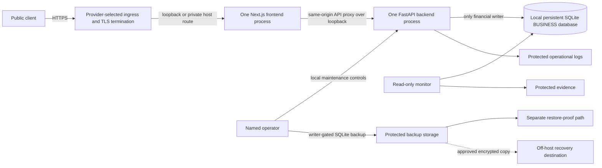

# M5.1-C4P7 SaaS server deployment foundation

**Date:** 2026-09-30  
**Project and product:** Chatbooks
**Scope:** Provider-neutral server foundation; no C4 execution  
**State:** **SERVER DEPLOYMENT FOUNDATION PREPARED — C4 NOT EXECUTED**

## 1. Decision and evidence boundary

C4P7 records the operator decision **D01 = B**:

`F:\ChatbookDeployment\m5-1-c4-controlled` is staging only. It is not the intended C4 server.

Every Windows path, database hash, fingerprint, release/recovery artifact, timing, listener result,
traffic exercise, and monitoring observation from C4P through C4P6 remains valid only as controlled
staging evidence. None of it approves or identifies the future server source. The future server has
not been selected or inspected, so no server source, capacity, security control, threshold, owner,
canary, signature, or final preflight is approved.

This milestone adds a deployable foundation and disposable verification. It did not provision a
real server, migrate schema v3 to v4, create a v4 target, run the C4 canary, start a v4 writer,
create PERSONAL data, or modify the repository development `chatbook.db`.

## 2. Selected deployment model

The selected model is one provider-neutral, single-server topology while SQLite remains the
financial persistence layer:



The ingress exposes only the frontend. The frontend serves pages and static assets and proxies
same-origin `/api/chatbook/*` requests to the internal FastAPI `/api/v1` boundary. FastAPI remains
the exclusive application write boundary over the deterministic accounting engine. The frontend,
monitor, ingress, and public clients have no SQLite access.

Exactly one backend process may hold authoritative financial write capability. Multiple frontend
processes are not required by this foundation; the initial contract uses one. Multiple backend
workers, rolling writer overlap, shared-network SQLite, and a second transaction store are
prohibited until a separately authorized persistence redesign. The `chatbook-api` entry point fixes
the Uvicorn worker count at one; the supervisor must also keep the backend instance count at one.

Provider, server operating system, domain, DNS, ingress product, TLS certificate source, process
supervisor, storage product, and monitoring destination are
`REQUIRES_OPERATOR_DECISION`.

## 3. Repository-derived deployment requirements

### 3.1 Backend

| Requirement          | Repository evidence                                                           | Exact deployment behavior                                                                                                                         |
| -------------------- | ----------------------------------------------------------------------------- | ------------------------------------------------------------------------------------------------------------------------------------------------- |
| Entrypoint           | `pyproject.toml`; `chatbook/api/main.py`                                      | Run `chatbook-api`; it calls `chatbook.api.main:run`.                                                                                             |
| Bind                 | `CHATBOOK_HOST`, `CHATBOOK_PORT` in `chatbook/api/main.py`                    | Bind to configured loopback address. Default is `127.0.0.1:8000`; the server config must be explicit.                                             |
| Process count        | SQLite single-writer architecture; `chatbook.api.main`; C4P7 process contract | `chatbook-api` runs one Uvicorn worker; the supervisor runs exactly one backend instance and never overlaps old/new backend writers.              |
| Python               | `pyproject.toml`, `uv.lock`                                                   | Python `>=3.12`; exact server release requires selection and verification. The current engineering run used Python 3.14.3.                        |
| Runtime dependencies | `pyproject.toml`, `uv.lock`                                                   | FastAPI and Uvicorn are runtime dependencies. Install the reviewed lock with `uv sync --locked`; use `--extra dev` only for release verification. |
| Health               | `GET /api/v1/health` in `chatbook/api/main.py`                                | Startup validates the selected database before routes become available. Health is 200 while accepting and 503 behind the maintenance gate.        |
| Shutdown             | `chatbook/api/main.py`, `chatbook/maintenance.py`                             | A protected shutdown request makes Uvicorn exit gracefully; the supervisor then applies its platform signal/timeout policy.                       |
| Logs                 | `CHATBOOK_OPERATIONAL_EVENT_LOG_PATH`                                         | Sanitized JSONL events include request ID, method, path, status, and duration, without credentials or financial payloads.                         |

### 3.2 Frontend

| Requirement        | Repository evidence                                         | Exact deployment behavior                                                                                                                                                                                                                          |
| ------------------ | ----------------------------------------------------------- | -------------------------------------------------------------------------------------------------------------------------------------------------------------------------------------------------------------------------------------------------- |
| Dependency install | `frontend/package-lock.json`                                | Run `npm ci` from `frontend` for the reviewed lock.                                                                                                                                                                                                |
| Build              | `frontend/package.json`                                     | Run `npm run build`. `.next` and required package assets must remain available to the start process.                                                                                                                                               |
| Start              | `frontend/package.json`                                     | Run `npm run start -- --hostname 127.0.0.1 --port <configured-port>`.                                                                                                                                                                              |
| Node               | Next 16.3.6 package metadata; Vitest 5.0.2 package metadata | Next requires Node `>=20.9.0`; repository verification also installs Vitest, which requires `^22.12.0`, `^24.0.0`, or `>=26.0.0`. The current engineering run used Node 24.13.0. The exact server Node release remains an operator release choice. |
| API proxy          | `frontend/src/app/api/chatbook/[...path]/route.ts`          | Set server-only `CHATBOOK_API_URL` to the loopback FastAPI `/api/v1` URL. Never expose the database or book identifiers to the browser.                                                                                                            |
| Static assets      | Next.js production output                                   | Ingress sends all public paths, including `/_next/*`, to the frontend. It does not serve repository, database, backup, or evidence directories.                                                                                                    |

### 3.3 Authentication and sessions

`chatbook/auth.py` uses scrypt password hashing and random opaque bearer tokens. Only token hashes are
stored in `auth_sessions`. The Next.js server-side proxy retains the raw token in an HTTP-only,
same-site cookie and sets `Secure` in production. Authentication, authorization, organization
scope, and financial writes remain backend decisions.

No new application secret is required by C4P7. User passwords, generated provisioning credentials,
TLS keys, provider credentials, deployment credentials, backup credentials, and any future secret
must remain outside the repository. The exact secret store and injection mechanism are
`REQUIRES_OPERATOR_DECISION`.

### 3.4 Database startup and schema selection

Normal startup resolves `RuntimeConfiguration` from server-owned variables:

| Variable                              | Purpose                                                                       |
| ------------------------------------- | ----------------------------------------------------------------------------- |
| `CHATBOOK_STORAGE_MODE`               | Exact `organization-v3` or `canonical-v4` adapter selection.                  |
| `CHATBOOK_SCHEMA_VERSION`             | Required expected schema paired to the mode.                                  |
| `CHATBOOK_DB_PATH`                    | Exact database file. C4P7 additionally requires an absolute path.             |
| `CHATBOOK_RUNTIME_ACCESS`             | `read-write` for schema v3; explicit read-only or approved read-write for v4. |
| `CHATBOOK_RUNTIME_RELEASE_ID`         | Immutable release identity; C4P7 requires a 64-character SHA-256 identity.    |
| `CHATBOOK_MAINTENANCE_CONTROL_PATH`   | Protected local maintenance-control file.                                     |
| `CHATBOOK_MAINTENANCE_STATE_PATH`     | Protected backend runtime-state file.                                         |
| `CHATBOOK_OPERATIONAL_EVENT_LOG_PATH` | Protected sanitized JSONL log.                                                |

Schema-v3 creation uses the normal `Database` initialization path and packaged `schema.sql`, which
sets schema version 3. The C4P7 provisioner then uses only `AuthService` and `AccountingEngine` to
create BUSINESS data. It never writes financial rows directly.

Normal schema-v4 selection already exists in `chatbook/runtime.py`. It requires an existing exact
target, mode/schema/access/release pairing, integrity and foreign-key checks, BUSINESS-only owner
scope, and canonical mapping verification. It never creates or migrates a target. C4P7 does not
activate it.

### 3.5 Backup, migration, and monitoring hooks

- `chatbook-migration-evidence` uses SQLite’s backup API under a writer-blocking transaction and
  builds deterministic manifests.
- `restore_verified_backup` restores to a new path and compares content/report fingerprints.
- `chatbook-canonical-rehearsal` is the reviewed reconstruction command. It remains a future C4
  operation and is not called by server startup or provisioning.
- `chatbook-c4-monitor` opens the selected database read-only/query-only and collects twelve signal
  groups without repair or ledger mutation.
- `chatbook-traffic-control` changes protected local maintenance files. No HTTP route or frontend
  state can change maintenance mode.

## 4. Server requirements

### KNOWN FROM REPOSITORY

| Area                | Requirement                                                                                                                                                                                                                    |
| ------------------- | ------------------------------------------------------------------------------------------------------------------------------------------------------------------------------------------------------------------------------ |
| Operating system    | Must run a supported Python `>=3.12`, compatible Node runtime, SQLite file locks, atomic same-filesystem rename, process supervision, local HTTP, restricted filesystem permissions, and protected logging. No OS is selected. |
| Python              | `>=3.12`; install from the reviewed `uv.lock`. Current verification used 3.14.3.                                                                                                                                               |
| Node                | Next runtime accepts `>=20.9.0`; the full locked verification toolchain constrains Node to `^22.12.0`, `^24.0.0`, or `>=26.0.0`. Current verification used 24.13.0.                                                            |
| CPU                 | Must run one backend process, one frontend process, SQLite backup/restore, and read-only monitoring. No numeric production minimum is evidenced.                                                                               |
| Memory              | Must support both runtimes and C4 backup/migration validation without swapping or process termination. No numeric production minimum is evidenced.                                                                             |
| Persistent disk     | Local, durable, SQLite-compatible filesystem. Database, backup, restore proof, future target, evidence, logs, recovery, and secrets use separate paths.                                                                        |
| Backup storage      | Separate protected location plus a future encrypted off-host copy. Off-host destination is absent.                                                                                                                             |
| Network             | Public HTTPS ingress only; frontend and backend bind to loopback. Backend and storage paths are never public.                                                                                                                  |
| Supervision         | Starts after configuration/storage validation; exactly one backend instance; prevents restart overlap; records health; supports graceful stop.                                                                                 |
| HTTPS/reverse proxy | Required for public SaaS traffic. Provider implementation is not selected.                                                                                                                                                     |
| Filesystem          | Supports SQLite locking, fsync/durability expected by SQLite, sufficient file-handle visibility, atomic replace, restricted identities, and access auditing.                                                                   |

### NEEDS SERVER MEASUREMENT

The following values cannot be derived from the Windows staging rehearsal and must be measured on
the selected server with its candidate database and release:

- CPU utilization and headroom during API load, backup, restore, migration rehearsal, report checks,
  and monitoring;
- steady and peak memory for Python, Node, SQLite, build/start, and maintenance validation;
- database growth, WAL/journal temporary space, backup/restore/target peak, log/evidence growth, and
  approved free-space margin;
- request latency, financial-command error rate, SQLite lock/write-error rate, graceful drain time,
  shutdown time, backup/restore time, migration time, validation time, and observation duration;
- ingress and upstream timeouts, maximum body size, connection limits, and failure behavior;
- off-host transfer and restore duration;
- retention volume and deletion/destruction behavior.

No production capacity, timeout, alert threshold, or maintenance window is claimed until those
measurements and named approvals exist.

## 5. Deployment package and configuration

The package is in [`deploy/saas`](../deploy/saas/README.md):

| Path                                             | Purpose                                                                            |
| ------------------------------------------------ | ---------------------------------------------------------------------------------- |
| `config/server.example.json`                     | Complete but intentionally invalid placeholder for protected server configuration. |
| `env/backend.env.example`                        | Server-owned backend variables; no credentials.                                    |
| `env/frontend.env.example`                       | Server-only frontend values and internal API URL.                                  |
| `contracts/processes.json`                       | One writer process, lifecycle, health, and prohibited overlap.                     |
| `contracts/ingress.json`                         | Public HTTPS to frontend only, timeout/drain and forwarded-header contract.        |
| `contracts/storage.json`                         | Separated private paths, backup method, and unresolved protection controls.        |
| `monitoring/operational-monitoring.example.json` | Hard-invariant inputs and unresolved empirical baselines/owners.                   |

`chatbook/saas_deployment.py` and `chatbook-saas-deployment` provide:

- strict config validation;
- sanitized environment rendering;
- schema-v3 BUSINESS candidate provisioning through existing services;
- read-only source inspection and manifest evidence;
- one controlled competing-writer test;
- maintenance-gated verified backup and separate restore proof; and
- static package contract checks.

It fails closed for a missing/relative database path, paths outside the deployment root, path
collisions, repository development database selection, unknown or mismatched schemas, invalid access
mode, mutable/non-hash release identity, non-loopback process binding, multiple backend writers,
raw book/owner selectors, PERSONAL activation, existing target artifacts, absent/mismatched database,
failed integrity/foreign-key checks, or backup outside sealed stopped maintenance.

It never automatically migrates, automatically selects v4, repairs data, creates PERSONAL rows,
exposes credentials, emits raw book IDs, or provides a second financial write path.

## 6. Database provisioning procedure

The future Application Operator follows this sequence on a newly selected server:

1. Install the reviewed backend release and frontend lock/build output.
2. Create a dedicated application identity and protected deployment root outside all web roots.
3. Copy `server.example.json` to a protected non-repository path and replace every placeholder with
   the actual server paths, immutable release hash, deployment ID, loopback ports, and schema-v3
   selection.
4. Prove the source, backup, restore-proof, and future-v4 paths are absent and distinct.
5. Run `chatbook-saas-deployment package-check --project-root <release-root>`.
6. Run `chatbook-saas-deployment validate-config --config <protected-config>`.
7. Run `chatbook-saas-deployment provision-v3 --config <protected-config>` once.
8. Move generated provisioning credentials into the approved secret lifecycle; do not copy them
   into logs, evidence, tickets, or the repository.
9. Run `chatbook-saas-deployment inspect --config <protected-config>` and retain the sanitized result.
10. Reconcile the source path, schema, SHA-256, schema/content/legacy fingerprints, row counts,
    report fingerprints, release identity, runtime-configuration fingerprint, and BUSINESS owner
    scope.
11. Assign named reviewers. The source remains a future candidate until the Release Owner and
    Accounting/Data Reviewer approve that exact evidence.

The representative source contains two organizations, OWNER/ADMIN/ACCOUNTANT/MEMBER/VIEWER
memberships, BDT with two minor-unit digits, USD with three, active/inactive accounts, open/locked
periods, projects, documents, draft/validated/confirmed proposals, postings, idempotent posting
retries, reversals, audit history, ledger/report projections, and balanced journals. These values are
test fixtures for migration coverage; they do not establish accounting policy.

No real server source was created during C4P7. Disposable tests only proved the procedure.

## 7. Single-writer guarantee

- The supervisor contract fixes backend instances at one.
- The `chatbook-api` entry point fixes Uvicorn workers at one.
- The backend binds to loopback and is the only identity granted database write permission.
- Frontend and ingress receive HTTP access only.
- Monitoring opens SQLite read-only/query-only.
- Backup uses SQLite’s backup API under a writer-blocking gate.
- Trusted CLI is disabled for unattended/public use. Named operators may use reviewed CLI commands
  only during an approved operation, under the same selected configuration and audit rules.
- Raw SQLite tools, ad hoc scripts, scheduled financial jobs, duplicate services, rolling backend
  overlap, and interactive administrator writes are prohibited.
- Maintenance drains accepted requests to zero, seals the gate, requests backend shutdown, verifies
  connection closure, inventories handles, and proves a controlled competing writer is blocked.
- The process supervisor must not restart the backend during maintenance or start a replacement
  before the previous writer has exited.

The deployment package enforces process count in configuration and contracts. Actual service,
process, scheduled-task, container, administrator, and file-handle evidence still requires elevated
inspection on the selected server.

## 8. Ingress and HTTPS contract

The provider implementation must satisfy `contracts/ingress.json`:

- terminate valid public HTTPS and redirect or reject plaintext HTTP;
- route all public paths to the loopback frontend only;
- keep FastAPI and every storage path inaccessible from public networks;
- preserve Next.js static assets and same-origin `/api/chatbook/*` behavior;
- sanitize client-supplied forwarding headers and set trusted values at the ingress;
- never use client IP headers as financial authorization;
- preserve request IDs within documented limits;
- never retry non-idempotent requests automatically;
- preserve backend maintenance `503` responses and never queue financial commands for later replay;
- expose only an approved public frontend health route while backend health remains internal;
- use measured upstream, keep-alive, body-size, and graceful-drain values; and
- record active connections at ingress, frontend, and backend during the future maintenance drain.

Nginx, Caddy, IIS, Cloudflare, managed load balancers, and other provider choices remain options;
none is selected or represented as implemented.

## 9. Persistent storage, backup, and recovery

The protected root separates:

1. live schema-v3 database;
2. fresh maintenance-window backup;
3. separate restore proof;
4. absent future schema-v4 target;
5. migration/preflight/monitoring evidence;
6. operational logs;
7. compatible recovery release;
8. runtime control/state; and
9. secrets/provisioning credentials.

The selected platform must prove filesystem compatibility, ownership, least-privilege ACLs, at-rest
encryption, capacity, access auditing, retention/destruction, and recovery release protection.

The future backup sequence is maintenance gate, drain to zero, backend shutdown, connection/file
handle reconciliation, SQLite writer-gate proof, SQLite backup API, SHA-256, preflight manifest,
restore to the configured new proof path, manifest/report reconciliation, and source-hash
preservation. `chatbook-saas-deployment backup-restore` implements the database portion and refuses
to run unless protected maintenance state says sealed, shutdown requested, stopped, and zero
in-flight.

Off-host recovery remains **BLOCKED**. It cannot close until an actual encrypted destination,
custodian, transfer record, access audit, hash comparison, retention rule, and successful restore
test exist.

## 10. Monitoring

Hard invariants are deterministic stop conditions:

- expected schema version;
- `PRAGMA integrity_check = ok`;
- zero foreign-key violations;
- zero idempotency resource disagreements;
- complete applicable audit-sidecar coverage;
- balanced/reconciled ledger projections;
- exact report reconciliation to the approved baseline; and
- no applicable migration failure.

Empirical values remain `BASELINE_REQUIRED`: request latency, graceful drain, shutdown, backup,
restore, migration, SQLite lock/write-error rate, financial-command-error rate, CPU, memory, disk,
log growth, and observation duration.

Process health, disk usage, backup freshness/result, and protected-artifact access require the
selected provider’s collector and alert channel. Monitoring owner, escalation owner, alert
destination, observation duration, and stop/rollback authority remain
`REQUIRES_OPERATOR_DECISION`. Monitoring may alert and stop traffic; it must never correct ledger
data automatically.

## 11. Maintenance controls and future C4 sequence

The future server must support this exact state progression without making the frontend
authoritative:

1. ingress and backend reject new financial requests;
2. accepted requests drain to zero at ingress, frontend, and backend;
3. supervisor restart is disabled and the sole backend writer exits gracefully;
4. connections, processes, services/tasks, administrative tools, and SQLite handles are reconciled;
5. the SQLite writer gate and controlled competing-writer proof pass;
6. a fresh protected backup and separate restore proof pass;
7. source/backup/restore manifests match and named reviewers record go/no-go;
8. the reviewed v3-to-v4 migration creates a new target under the runbook;
9. only explicit `canonical-v4`, schema 4, exact path/release, `read-only` configuration starts;
10. read-only parity/integrity/API/report acceptance passes;
11. the unchanged BUSINESS canary runs only after Accounting/Data Reviewer and Release Owner approval;
12. one writer resumes only after every signature and rollback-boundary acknowledgement; and
13. staffed monitoring continues for the approved observation period.

The existing rollback boundary remains unchanged: transaction rollback before v4 commit; verified
v3 restore only after commit with complete proof that no v4 financial write occurred; after any v4
financial write, preserve new history and use audited forward recovery.

## 12. Deployment commands

The following are exact application commands. Provider installation, service definition, firewall,
DNS, certificate, filesystem, identity, and secret-store commands cannot be exact until the server
platform is selected.

```text
uv sync --locked --extra dev
cd frontend
npm ci
npm run build

chatbook-saas-deployment package-check --project-root <release-root>
chatbook-saas-deployment validate-config --config <protected-server-config.json>
chatbook-saas-deployment provision-v3 --config <protected-server-config.json>
chatbook-saas-deployment inspect --config <protected-server-config.json>
chatbook-saas-deployment environment --config <protected-server-config.json>

chatbook-api
npm run start -- --hostname 127.0.0.1 --port <configured-frontend-port>

chatbook-traffic-control --control <control-path> --state <state-path> status
chatbook-c4-monitor <monitoring-config> --evidence <protected-evidence-path>
```

The output of `environment` is a sanitized mapping for a protected supervisor adapter. It contains
paths and runtime identity, not credentials. It must not be treated as a shell script or committed as
an actual server configuration.

## 13. Unresolved provider and operator decisions

- actual server/provider/region and operating system;
- domain, DNS, ingress/reverse proxy, TLS certificate lifecycle, firewall, and trusted proxy ranges;
- immutable backend release and exact Python/Node releases;
- application/service identity, process supervisor, deployment method, restart policy, and signal;
- absolute storage paths, filesystem type, mount durability, ownership, ACLs, and access audit;
- CPU, memory, disk, IOPS, network, and capacity margin;
- encryption, off-host backup destination, credentials, custodian, restore drill, retention, and
  destruction;
- named release, migration, application, accounting/data, incident, monitoring, and escalation owners;
- baseline-derived timeouts/thresholds, maintenance window, observation duration, and alert route;
- exact server schema-v3 source approval, recovery release, canary approval, rollback
  acknowledgement, signatures, final preflight, and go/no-go.

Until these are completed with actual server evidence, the environment is not production-ready and
C4 remains unauthorized.
