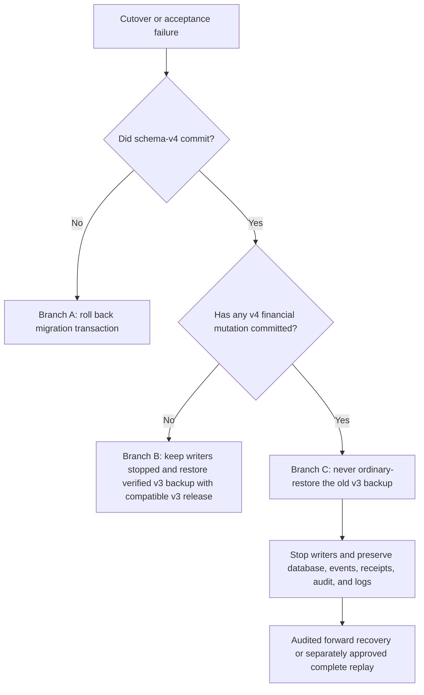

# M5.1-C4 controlled BUSINESS cutover runbook

**Project and product:** Chatbooks
**Status:** C4P7: **SERVER DEPLOYMENT FOUNDATION PREPARED — C4 NOT EXECUTED**; execution is
prohibited until M5.1-C4 is explicitly authorized  
**Scope:** One offline SQLite schema-v3 to schema-v4 BUSINESS cutover; no PERSONAL owner or feature

**Latest deployment-preparation evidence:** On 2026-09-28 C4P created a separate, persistent,
controlled schema-v3 BUSINESS staging environment at
`F:\ChatbookDeployment\m5-1-c4-controlled`. It includes a restricted source, backup/restore proof,
runtime controls, deterministic release identity, monitoring plan, and an unexecuted canary
definition. C4P2 has since implemented server-only normal v4 runtime selection and a read-only
acceptance mode, without activating either against this environment. It is not production evidence,
and C4 remains **NO-GO** because source approval, operational controls/approvals, monitoring
assignment, capacity/window approval, and named signatures remain unresolved. See
[`M5_1_C4P_DEPLOYMENT_PREPARATION_REPORT.md`](M5_1_C4P_DEPLOYMENT_PREPARATION_REPORT.md) and the
current
[`M5_1_C4P5_TRAFFIC_MONITORING_REPORT.md`](M5_1_C4P5_TRAFFIC_MONITORING_REPORT.md),
[`M5_1_C4P4_OPERATIONAL_READINESS_REPORT.md`](M5_1_C4P4_OPERATIONAL_READINESS_REPORT.md), and
[`M5_1_C4_APPROVAL_MATRIX.md`](M5_1_C4_APPROVAL_MATRIX.md). This runbook was not executed. C4P2
closes the normal schema-v4 selector engineering blocker only; every human and deployment gate
remains separately enforceable.

This runbook is the operator procedure for a future C4 cutover. C4A exercised it only with synthetic
data in disposable files. It does not authorize migration of a shared database, selection of schema
v4 by the normal application, or writer resumption.

**C4P7 successor decision:** D01=B. The Windows environment and every value in the historical table
below are staging only and cannot be the final C4 target/source. The selected future server must use
the provider-neutral
[`M5_1_C4P7_SAAS_DEPLOYMENT_FOUNDATION.md`](M5_1_C4P7_SAAS_DEPLOYMENT_FOUNDATION.md), then regenerate
and approve every path, hash, fingerprint, recovery artifact, capacity result, and operator command
before this runbook may begin.

## Historical controlled C4P staging target

The prepared values below are preserved only as staging evidence. D01=B makes them ineligible for
the final C4 window. The future server must generate a new evidence set.

| Setting                  | Prepared value                                      |
| ------------------------ | --------------------------------------------------- |
| Root                     | `F:\ChatbookDeployment\m5-1-c4-controlled`          |
| Source                   | `source\chatbook-business-v3.db`                    |
| Fresh-backup destination | `backup\chatbook-business-v3.backup.db`             |
| Restore proof            | `restore-proof\chatbook-business-v3.restore.db`     |
| Reserved target          | `target\chatbook-business-v4.db`                    |
| Evidence                 | `evidence`                                          |
| Controls                 | `controls`                                          |
| Compatible v3 recovery   | `recovery\chatbook-v3-release-6ef3b02b4e78783a.zip` |

The prepared backup is rehearsal evidence. Create and restore-test a new backup after the actual
maintenance writer gate. Run `controls\Stop-Application.ps1`, complete the external drain and
elevated service/task/file-handle checks, and then run `controls\Verify-Quiescence.ps1`. The script
is supporting evidence; the signed operator checks remain mandatory.

The C4P source is schema v3 with content fingerprint
`bb2574b83dcd0855ef5b52150905e256f90208075e1c5e3a6623e2fc7cfe12c2`. C4P2 restored it from the
verified backup after an authentication-only session change; the recorded physical identity must be
reviewed and approved before C4. The v4 target must be absent at the start of C4. The normal-runtime
v4 selector exists, but it must remain disabled until the migration commits and must use
`read-only` access throughout post-migration acceptance.

### C4P5 local traffic and monitoring controls

The inspected topology has direct local HTTP only. **NO EXTERNAL TRAFFIC TERMINATION PRESENT.** The
FastAPI process owns the fail-closed maintenance gate. No request or frontend state can toggle it.
If an external ingress is later found or introduced, its own rejection/drain control becomes an
additional prerequisite.

During a separately authorized maintenance window, the Application Operator must use this order:

1. collect the schema-v3 baseline with `controls\Collect-Monitoring.ps1`; its fixed protected
   configuration must select the pre-cutover schema-v3 phase;
2. run `controls\Enter-Maintenance.ps1 -DrainTimeoutSeconds <approved-value>`;
3. prove the maintenance state is sealed with zero in-flight requests;
4. disable every CLI, administrative, scheduled, service, and other writer from the approved
   elevated inventory;
5. run `controls\Stop-Application.ps1 -ShutdownTimeoutSeconds <approved-value>`;
6. reconcile PIDs, listeners, processes, services, tasks, and database handles;
7. run `controls\Verify-Quiescence.ps1` and preserve its rolled-back writer-lock proof;
8. collect monitoring again and stop if any hard invariant alerts;
9. only then enter the fresh backup step after explicit go/no-go.

Timeouts and baseline-dependent alert thresholds have no defaults because they require operator
evidence. Owners, alert destination, escalation, observation duration, and stop/rollback decision
authority remain `REQUIRES_OPERATOR_DECISION`.

## Roles and recorded artifacts

Assign named people before the window:

- **release owner:** owns the go/no-go decision and writer-resumption signature;
- **migration operator:** runs the reviewed commands and records timestamps;
- **application operator:** rejects new writes, drains requests, and proves processes are stopped;
- **data/accounting reviewer:** approves the preflight, financial parity, audit, and report evidence;
- **incident recorder:** records every command result, decision, and recovery action.

Use a restricted local directory on the deployment host. The source, backup, restored proof, v4
target, manifests, and command output contain sensitive identity and financial evidence. Restrict
access before copying data, prohibit ordinary application-log ingestion, record a retention owner,
and do not place artifacts in the repository.

Record these values in the change record. Resolve every path before starting and prove that the
source, backup, restore, and target paths differ.

```powershell
$cutoverSource = '<absolute closed schema-v3 database path>'
$cutoverBackup = '<absolute restricted fresh backup path>'
$cutoverRestore = '<absolute restricted restore-proof path>'
$cutoverTarget = '<absolute new schema-v4 target path>'
$releaseVersion = '<immutable application release identifier>'
```

The current repository has no production deployment definition. C4P provides fixed controls for its
staging root and a reviewed read-only v4 selection boundary. The application operator must still add
the environment-specific stop, drain, process-inventory, configuration-activation, and restart
commands to the approved change record before C4. C4A/C4P2 must not guess them.

## Preconditions and automatic stop conditions

Do not enter pre-cutover unless every preflight-entry item in
[`M5_1_C4_RELEASE_CHECKLIST.md`](M5_1_C4_RELEASE_CHECKLIST.md) is signed. Post-migration acceptance,
canary, and writer-resumption items remain unchecked until their named phase and block progression
at that phase. Stop immediately if:

- any writer cannot be identified or stopped;
- the source is not schema v3 or is not the approved database identity;
- free space is below the approved measured requirement plus approved margin;
- backup, restore, preflight, manifest, integrity, foreign-key, parity, trigger, or report evidence
  differs;
- an artifact path or permission is wrong;
- the exact v3 recovery application is unavailable;
- the v4 release cannot stay read-only until sign-off;
- any unexplained financial command, audit-sidecar, constraint, idempotency, lock, or latency error
  occurs.

No migration step may repair, delete, normalize, or reinterpret financial history.

## PRE-CUTOVER

1. **Announce maintenance.** Record the start time, release owner, affected business spaces, user
   message, and escalation channel. Return a stable maintenance response for financial commands.
2. **Stop or reject all writers.** Stop API write traffic, local CLI use, background jobs,
   administrative scripts, scheduled tasks, and any process with a write-capable connection. Do not
   queue commands for silent replay and do not dual write.
3. **Drain active requests.** Wait for in-flight commands to finish or fail. Record the drain start,
   end, and outstanding-request count. It must reach zero.
4. **Verify quiescence.** Inventory processes and open file handles. Acquire SQLite's immediate
   writer lock from the migration process. A second controlled writer probe must receive a locked
   response while the gate is held. If the gate cannot be acquired, stop.
5. **Record versions.** Record the source file hash, `PRAGMA user_version` (must be `3`), SQLite
   version, migration tool version, `$releaseVersion`, filesystem, available bytes, and approved
   maintenance budget.
6. **Create a fresh protected backup.** While the writer gate remains held, use SQLite's backup API:

   ```powershell
   chatbook-migration-evidence $cutoverSource $cutoverBackup
   ```

   Treat a command failure or non-verified result as a stop. Record the backup SHA-256 and size.

7. **Restore the backup separately.** Use the reviewed `restore_verified_backup` operation or the
   C4 wrapper built from it to restore `$cutoverBackup` to `$cutoverRestore`. The target must not
   exist. Run the v3 preflight against the restore and open it with the exact compatible v3 release.
8. **Compare manifests.** Source snapshot, backup, and restore must have the same legacy content
   fingerprint, report fingerprints, table counts/hashes, audit sequence evidence, receipts,
   reversals, and proposal lifecycle evidence. Capture the manifest in restricted storage.
9. **Final go/no-go.** The migration operator and data/accounting reviewer sign the preflight. Keep
   writers stopped. A mismatch ends the window without migration.

## MIGRATION

The current reviewed reconstruction command creates a new target and never changes the source:

```powershell
chatbook-canonical-rehearsal $cutoverSource $cutoverTarget $cutoverBackup
```

The C4 release wrapper must preserve these exact ordered gates:

1. Re-run preflight and verified-backup checks under the held writer gate.
2. Restore the verified v3 backup to the new target.
3. Begin one immediate migration transaction and disable only the old financial triggers inside that
   transaction.
4. Create constrained temporary v4 tables.
5. Reconcile BUSINESS book ownership, currency, and precision.
6. Copy charts/accounts, periods, proposals/lines, validations/fingerprint versions,
   confirmations/provenance, receipts, journal entries/lines, project/document extensions, and audit
   sidecars in dependency order while preserving all IDs and values.
7. Compare every v4 projection to the exact v3 ordered count and SHA-256 evidence. A difference
   rolls the transaction back.
8. Swap tables in the same transaction.
9. Install canonical constraints, indexes, immutability guards, audit triggers, audit-sidecar guards,
   and write-context triggers.
10. Run full foreign-key checking, SQLite integrity checking, final projection reconciliation,
    trigger inventory, query-plan checks, and schema inspection.
11. Set `PRAGMA user_version = 4` only at the final gate and commit.
12. Keep every application writer stopped. Preserve the v3 source, verified backup, restore proof,
    and evidence.

## POST-MIGRATION BEFORE WRITERS

Use only the reviewed `canonical-v4` plus `read-only` application selection. C4P2 implemented and
tested this normal path, but did not activate it or create a target. The exact release, database
path, schema, access mode, and configuration fingerprint must be recorded before starting it.

1. Confirm schema version `4`, `PRAGMA integrity_check = ok`, zero foreign-key violations, expected
   tables, expected triggers, expected indexes, and no `v4_` or `v3_` reconstruction residue.
2. Re-run exact migration projection hashes, audit-event count/hash/sequence, audit-sidecar coverage,
   receipt counts/hashes, reversal relationships, and legacy fingerprint verification.
3. Compare account balances, trial balance, general ledger, income statement, balance sheet,
   caller-specified cash movements, and project views for every organization and tested date boundary.
4. Run authenticated **read-only** API checks for organizations, projects, accounts, periods,
   proposals, entries, reports, and audit. Confirm cross-organization requests remain denied and no
   book identifier becomes client authority.
5. Run trusted read-only CLI catalog, ledger, trial-balance, report, and audit checks using the
   explicit reviewed v4 release path.
6. Compare OpenAPI, status codes, response shapes, pagination, ordering, and frontend-consumed
   payloads to the approved v3 baseline.
7. Verify an existing confirmation and posting idempotency key resolves to its existing immutable
   resource without a new effect. Do not create a new financial event yet.
8. Record the post-commit manifest. The release owner and data/accounting reviewer either accept it
   or choose rollback branch B below. Writers remain stopped throughout.

## CANARY

The canary starts only after post-commit read-only acceptance and an explicit release-owner
signature. Its data, organization, accounts, project/document attribution, amount, date, and reason
must be approved in the change record; this runbook does not invent accounting classification.

Using the unchanged authenticated API and caller-supplied keys:

1. Create one controlled proposal.
2. Retrieve and review the exact proposal version.
3. Validate it and record the fingerprint/version.
4. Confirm that exact version as the authenticated approved actor.
5. Post it once with the recorded idempotency key.
6. Retry the same posting key and prove that it returns the same journal entry without another line,
   receipt, or financial effect.
7. Confirm the journal is balanced and appears exactly once in ledger, balances, reports, project
   attribution, audit, receipt, and audit-book sidecar.
8. Create the approved compensating reversal proposal, validate, confirm, post, and retry it.
9. Confirm the original remains visible, the reversal remains visible, net balances return to the
   approved expected state, and both histories are fully audited.

If any canary step fails after the proposal or another v4 financial mutation commits, use rollback
branch C. Never restore the old v3 backup as an ordinary rollback.

## WRITER RESUMPTION

Normal writers may resume only after all of these named signatures are recorded:

- engineering signs schema, migration, parity, constraints, triggers, audit/sidecar, idempotency,
  source-boundary, and recovery evidence;
- accounting/data signs financial counts, hashes, balances, reports, reversals, audit, and canary;
- product/operator accepts the observed maintenance duration, remaining window, user communication,
  capacity margin, protected artifacts, monitoring ownership, and rollback-window closure;
- the release owner explicitly records: **“Read-only acceptance passed; the canary passed; resuming
  v4 writers ends ordinary v3-backup rollback.”**

Resume one writer pool first. Confirm schema version, command error rate, lock waits, idempotency
conflicts, audit/sidecar insertions, invariants, report health, migration errors, and request latency.
Expand only under the approved deployment procedure. Keep the v3 source and backup immutable for the
approved retention period.

## Rollback decision tree



### Branch A — failure before v4 commit

Roll back the one migration transaction. Verify the target is still a complete schema-v3 restored
snapshot, re-run integrity/preflight, preserve diagnostics, and keep writers stopped until the source
and recovery choice are verified. The source database must remain unchanged.

### Branch B — failure after v4 commit and before every v4 financial write

Keep writers stopped. Prove from audit, receipt, and request evidence that no v4 financial mutation
committed. Restore the verified v3 backup with its exact compatible v3 application, re-run the source
manifest and read checks, and obtain release-owner approval before reopening. If the no-write proof
is incomplete, branch B is forbidden.

### Branch C — failure after any v4 financial write

**Never restore the old v3 backup as an ordinary rollback.** Doing so would destroy committed
proposal, confirmation, posting, receipt, reversal, or audit history. Stop writers; preserve the v4
database and every new event; copy it for investigation; reconcile the new history; then use an
audited forward repair or a separately designed and approved replay that preserves every committed
event and idempotency result. Accounting/data and release-owner approval are mandatory.

## Immediate monitoring checklist

The fixed local collector is `controls\Collect-Monitoring.ps1`, backed by
`chatbook-c4-monitor` and `config\operational-monitoring.json`. It writes sanitized structured
evidence under `evidence`. Wrong schema, failed integrity, foreign-key violations, idempotency
disagreement, applicable audit-sidecar mismatch, ledger/report reconciliation mismatch, and
migration failure are hard stop conditions. Lock/error rates, latency, migration duration, and
drain duration remain `BASELINE_REQUIRED`; the collector does not invent their thresholds.

The C4 change record must name an owner, threshold, query/log source, and escalation path for each:

- [ ] application and database schema-version mismatch;
- [ ] financial proposal, validation, confirmation, posting, reversal, and period-lock errors;
- [ ] SQLite busy/locked errors and unusually long writer waits;
- [ ] idempotency conflicts, unexpected duplicate keys, or retry-resource disagreement;
- [ ] audit-event insertion, audit-sidecar insertion, sequence, or coverage failures;
- [ ] unbalanced entry, proposal/journal mismatch, foreign-key, integrity, or immutable-history alarm;
- [ ] trial balance, ledger, statement, project view, or report reconciliation failure;
- [ ] migration/version/trigger/index/authorizer errors;
- [ ] unusual authenticated API and report latency;
- [ ] backup, manifest, or database-file access outside the approved operator group.

Monitoring reports and alerts must not contain credentials, session tokens, proposal descriptions,
line contents, complete audit JSON, or raw backup/manifests. Monitoring may stop traffic and alert;
it must never auto-correct ledger data.
