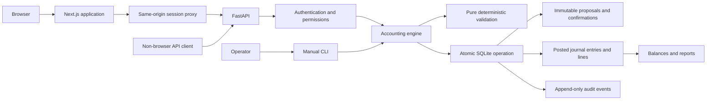
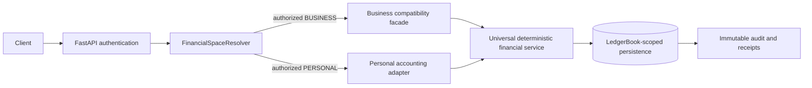

# Chatbooks architecture

## Current scope

Chatbooks currently has a Next.js customer-facing application and a FastAPI application boundary
around the hardened Python accounting kernel and SQLite store. The `chatbook` CLI is the canonical
project command.
M3 implements authenticated clients, organization roles, typed HTTP workflows, confirmation
provenance, and command idempotency for business organizations. M3.5 changes the product direction
without adding code or schema. M4 adds the responsive Chatbooks shell, business context UI,
progressive financial views, and guarded proposal workflows. M5.0 specifies personal ownership,
isolation, ledger reuse, accounts, categories, transfers, opening balances, liabilities, reporting,
and future API/database impact without adding code or schema. Personal finance persistence,
Financial Space discovery, general budgets, financial reminders, AI, extraction, integrations, and
cloud deployment remain unimplemented.
M5.1-C1/C2 add the BUSINESS book mapping and universal financial-service seam. M5.1-C3 adds a
schema-v4 canonical book repository and migration rehearsal for disposable copies while normal
application startup remains on schema v3. M5.1-C4A adds a synthetic-only operational rehearsal and
future-cutover documentation without changing that selection. M5.2-A defines the simplified
personal-finance policy and implementation constraints without adding a personal owner, schema,
route, UI, or posting behavior.

## Boundaries

| Module                                    | Owns                                                                                                     | Must not own                                                                                   |
| ----------------------------------------- | -------------------------------------------------------------------------------------------------------- | ---------------------------------------------------------------------------------------------- |
| `chatbook/domain.py`                      | Immutable value objects, enums, dates, exact amount parsing, balanced-line validation                    | SQL, prompts, model calls                                                                      |
| `chatbook/engine.py`                      | BUSINESS authorization/context resolution, business extensions, and compatibility result shaping         | Independent financial lifecycle/arithmetic, authentication, AI interpretation                  |
| `chatbook/financial/`                     | Authorized context, typed commands/repository port, and the sole deterministic financial service         | Owner policy, SQL, raw connections, product presentation                                       |
| `chatbook/database.py`                    | Connection settings, atomic writes, migration initialization, audit triggers                             | Business intent                                                                                |
| `chatbook/canonical_database.py`          | Explicit schema-v4 rehearsal connection, book context, atomic writes, and audit authorizer               | Normal startup, schema migration, product policy                                               |
| `chatbook/canonical_migration.py`         | v3→v4 disposable-copy orchestration, reconciliation, rollback evidence, and measurement                  | Live cutover, history repair, writer resumption                                                |
| `chatbook/cutover_readiness.py`           | New-directory-only synthetic fixture, backup/restore, parity, capacity, canary, and recovery evidence    | Existing/shared database input, live deployment, accounting policy, ordinary writer resumption |
| `chatbook/storage/sqlite_organization.py` | Temporary schema-v3 repository adapter                                                                   | Canonical ownership or raw public SQL                                                          |
| `chatbook/storage/sqlite_book.py`         | Canonical schema-v4 book repository adapter                                                              | PERSONAL ownership, raw public SQL, accounting policy                                          |
| `chatbook/schema.sql`                     | Relational identities, tenant references, checks, posting guards, immutability                           | Conversation state                                                                             |
| `chatbook/cli.py`                         | Manual input, proposal preview, explicit confirmation, JSON output                                       | Accounting arithmetic or direct ledger writes                                                  |
| `chatbook/auth.py`                        | Password hashing, credential registration, opaque sessions, revocation                                   | Organization permission policy or accounting writes                                            |
| `chatbook/permissions.py`                 | Explicit role-to-permission mapping                                                                      | Authentication or accounting decisions                                                         |
| `chatbook/api/`                           | Typed HTTP contracts, authenticated actor derivation, authorization, pagination, errors, request logging | SQL, ledger arithmetic, posting logic, or client-supplied actor trust                          |
| `frontend/src/app/`                       | Next.js routes, responsive application shell, and same-origin API proxy                                  | Ledger arithmetic, SQL, or independent accounting rules                                        |
| `frontend/src/features/`                  | Context-aware presentation and API-driven user workflows                                                 | Authoritative authorization or direct accounting mutations                                     |
| `frontend/src/lib/api/`                   | Typed browser API client and contracts                                                                   | Bearer-token access, database access, or financial calculations                                |
| `tests/`                                  | Domain, database, concurrency, persistence, and subprocess acceptance checks                             | Production financial data                                                                      |



The web proxy exchanges credentials with FastAPI and stores the returned opaque bearer token in an
HTTP-only, SameSite cookie. Browser code calls only the same-origin `/api/chatbook` proxy. The proxy
forwards the authenticated request and idempotency/request headers; FastAPI still derives identity,
checks organization permission, and invokes the engine. Frontend permission checks only shape the
experience and are never authoritative.

M4 adds one read model to the API: the paginated journal-entry summary list. Summary totals, line
counts, and project IDs are assembled by the accounting engine from posted ledger records. This
keeps transaction-list arithmetic out of React and does not add a write path or persistence model.

## M5.0 future personal boundary

M5.0 retains the tagged Financial Space application model and resolves future PERSONAL references to
a separate `PersonalSpace` aggregate:

```mermaid
flowchart LR
    Session[Authenticated user] --> Resolver{Typed FinancialSpaceRef}
    Resolver -->|BUSINESS + organization_id| Business[Existing organization API and roles]
    Resolver -. future .->|PERSONAL + personal_space_id| Personal[Personal owner and API]
    Business --> BusinessFacade[AccountingEngine compatibility facade]
    Personal -. future .-> PersonalAdapter[PersonalAccountingAdapter]
    BusinessFacade --> LedgerService[Ownership-neutral deterministic ledger service]
    PersonalAdapter -. future .-> LedgerService
    LedgerService --> Books[Owner-bound ledger books]
    Books --> Posted[Posted entries, reports, immutable audit]
```

The personal owner is one user and one private space in the initial model. Organization membership
does not grant personal access. Personal and organization route families remain distinct; a future
discovery endpoint may list typed accessible contexts without returning their financial data.

The existing accounting invariants are reusable, but the current engine and schema cannot accept a
personal owner through only a thin adapter because membership, periods, foreign keys, idempotency,
audit, and reports are keyed by `organization_id`. Future implementation therefore needs an internal
`LedgerBook` ownership seam and an ownership-neutral application service. This is a concrete
ownership refactor, not a redesign of double-entry rules. Existing organization routes, identifiers,
history, and results remain behind the current compatibility facade throughout migration.

Personal account profiles and categories are application-domain records mapped deterministically to
owned ledger accounts. Opening balances and same-space transfers become proposals. Cross-space
movements create separately authorized effects in each ledger plus a non-financial correlation; no
journal spans spaces. Full details and decision gates are in
[`personal-finance-model.md`](personal-finance-model.md).

## M5.1 universal core architecture and implemented rehearsal persistence

M5.1-A confirms that the final ownership seam must be persisted. Financial Space remains the typed
application context, while a future internal `LedgerBook` becomes the canonical database scope for
financial records. Each book has exactly one typed owner—Organization or PersonalSpace—and one
currency/precision configuration.



The implemented BUSINESS resolver derives the actor from the authenticated or trusted compatibility
boundary, checks organization membership, and issues an immutable authorized context containing the
space, mapped book, currency, precision, capabilities, and provenance. Clients never authorize
themselves with a ledger-book ID. The business facade preserves current paths, roles, payloads, IDs,
and report results. A future personal adapter would supply separately approved ownership and
account/category mappings. Neither facade writes journal rows or calculates authoritative totals.

The target core tables use `ledger_book_id` with composite ownership foreign keys and book-scoped
posting triggers. Projects and business document references remain constrained business extensions.
Migration proceeds through additive mapping, service extraction, canonical-table construction,
reconciliation, and atomic cutover. Existing IDs, audit sequences/payloads, receipts, reversal
chains, and report results must remain unchanged.

Tax, VAT/GST, payroll compliance, statutory formats, filing, and country-specific rules are external
versioned capability layers. They may read authorized core results and create proposals, but they
cannot write the ledger directly. See [`universal-financial-core.md`](universal-financial-core.md)
and ADRs [0018](decisions/0018-persistent-ledger-book-seam.md),
[0019](decisions/0019-authorized-context-and-adapters.md), and
[0020](decisions/0020-jurisdiction-compliance-outside-core.md).

M5.1-C1 implements the additive mapping stage. Schema v3 has one immutable
BUSINESS `ledger_books` row per organization with deterministic ID
`book:business:<organization_id>`, copied currency/precision, creation timestamp, source, and tool
version. Database triggers create the row atomically with every new organization and reject
replacement, update, deletion, orphan ownership, ID mismatch, and currency/precision mismatch.

The v2→v3 runner holds `BEGIN IMMEDIATE`, creates a SQLite-consistent backup, proves a separate
restore, runs read-only structural/report evidence on the copy, adds the mapping, compares hashes for
every pre-existing table, verifies one-to-one ownership, and advances `user_version` only before a
successful commit. No ledger-book creation audit event is emitted because this is internal migration
metadata rather than a financial mutation. Existing financial/audit rows are neither updated nor
regenerated.

M5.1-C2 implements the universal service and business facade over those unchanged tables. The
service accepts only an `AuthorizedFinancialContext`, enforces an explicit capability for each
operation, and contains the one active implementation of account/period operations, proposal
lifecycle, confirmation, idempotent posting, reversal, ledger reads, reports, and audit parsing. The
repository boundary is typed and context-bound; it exposes neither arbitrary SQL nor the private
SQLite connection. The schema-v3 storage adapter validates the BUSINESS book mapping again before a
repository or unit of work is used.

M5.1-C3 implements schema v4 on distinct disposable copies. Its orchestrator requires passing v3
preflight evidence and a restore-verified backup, reconstructs financial tables under temporary
names, copies all stable IDs and values, reconciles legacy projections before table swap, installs
book-aware constraints/triggers/indexes, runs foreign-key and integrity checks, and sets
`user_version = 4` only at the last uncommitted gate. Failure injection after every major stage
returns the target to a complete schema-v3 snapshot and leaves the source unchanged.

The v4 repository scopes every financial operation by `ledger_book_id`. Business project/document
associations reside in extension tables constrained to the book's exact organization. Existing
`audit_events` rows and SQLite sequence state are not rewritten; the immutable
`audit_event_book_scopes` sidecar maps each applicable event to one book. New financial audit
triggers append the legacy-shaped event and sidecar together. Validations retain their exact bytes
and carry fingerprint version `organization-v1`.

No API schema or route accepts `ledger_book_id`, a raw authorized context, or a PERSONAL identifier.
Normal API, CLI, and `Database` startup still select schema v3. Schema v4 is available only through
explicit rehearsal factories, so C3 does not perform the production/business cutover. PersonalSpace,
personal behavior, the personal adapter, and ordinary v4 writer resumption remain later work.

M5.1-C4A rehearses the operational envelope without changing those facts. Its command constructs a
new synthetic v3 database rather than accepting a database path, blocks a competing writer during
backup, verifies a separately retained restore, migrates only new disposable targets, captures exact
engine/API/CLI parity, and runs controlled success/failure canaries only on v4 clones. Deployment
process control, protected production artifacts, normal v4 release selection, and writer resumption
remain C4 blockers.

## M5.2-A personal MVP policy boundary

M5.2-A does not alter the selected architecture. A future personal adapter still resolves a private
`PersonalSpace`, maps presentation accounts and versioned categories to explicit same-book ledger
accounts, and calls the existing universal financial service. The policy narrows the first account
kinds to Checking, Savings, Cash, Credit Card, and Personal Loan and narrows default personal reads
to Balances, Activity, Income, Spending, Category Spending, and Cash Position.

The safe generic path is deliberately small: typed personal ownership, same-book account/category
mappings, the existing proposal-to-audit lifecycle, same-space asset transfers, explicit
principal-only liability reductions, and posted-data read models. There is no separate personal
transaction store, mutable balance, category total, or reporting arithmetic.

The adapter must be feature-gated by policy capability. Income, expense, and credit-card commands
require approved default ledger/category mappings. Opening-balance commands additionally require an
approved offset and date/period policy. Personal posting requires an approved period-coverage
policy even though periods remain hidden from normal personal navigation. Cash Position requires an
approved account-inclusion and negative-balance policy. A missing policy fails closed before
proposal creation; it is not replaced by an adapter default.

The current runtime remains unchanged: normal startup uses schema v3, schema v4 remains rehearsal
only, and no PERSONAL owner exists. M5.1-C4 and a separately authorized personal implementation and
migration must complete before personal writes can be enabled. See
[`personal-finance-model.md`](personal-finance-model.md).

## Domain persistence

Organizations own projects and documents in both schema versions. Schema v3 also keeps all financial
children organization-scoped. Schema-v4 rehearsal copies make the mapped BUSINESS LedgerBook the
canonical financial owner and keep project/document links in constrained business extensions. Users
are global identities, linked through organization memberships with explicit roles. API credentials are
separate from the accounting user identity.
Passwords are stored as salted scrypt hashes. Opaque bearer tokens are random, stored only as
SHA-256 hashes, expire, and can be revoked. Account types are asset, liability, equity, revenue, and
expense; accounts are created manually. No default accounting rules or chart templates are supplied.

A `transactions` row represents an immutable manual proposal. Its `transaction_lines` are distinct
from `journal_lines`. Validation and confirmation are separate immutable records. A posted journal
entry references exactly one proposal, confirmation, period, and optional reversal target. Composite
foreign keys include the organization ID, preventing cross-organization references.

Every proposal has explicit version `1` under the current immutable-proposal model. Confirmation
provenance records that version, the proposal, UTC time, authenticated actor through the confirmation,
and caller request identifier. Immutable command receipts make confirmation and posting retries safe.

Project dimensions live on individual lines; every line may optionally refer to one project.
Projects retain name, context, client, expected revenue, budget, dates, and status. Document records
hold metadata, an operator-supplied SHA-256 checksum, and an opaque storage reference. They do not
store or interpret document content.

## Atomicity and consistency

Each mutating engine call uses `BEGIN IMMEDIATE`. SQLite serializes writers before the engine reads
posting conditions, preventing a period lock or competing posting from interleaving with a post.
The journal header, copied lines, posting transition, and audit events commit together. Any error
rolls back all of them. There is no externally visible partially posted entry from a supported call.
Concurrent post/lock and competing-reversal tests verify that outcomes are serializable and leave no
partial state.

The internal `assembling` state allows the database to check aggregate balance at the transition to
`posted`. Ledger/report queries always filter to `posted`. Directly inserted assembling rows never
affect balances. Unsupported raw SQL is not an application interface.

Posting rechecks the proposal fingerprint, account activity, open period, exact reversal lines,
confirmation actor, and duplicate reversal state. Database triggers independently check balance,
period/date compatibility, confirmation/proposal linkage, line equality, and reversal equality.
Unique indexes enforce one posting per proposal and one direct posted reversal per target entry.

Reports load committed posted lines in one SELECT and aggregate with Python integers. No mutable
balance cache exists. Account definitions are immutable except their active flag. Date-filtered
reports use the accounting date, not audit time. Different report requests may naturally observe
different commits; there is no multi-report snapshot/export session yet.

The API cash-flow route calls an engine report that returns unclassified cash movements for asset
accounts explicitly selected by the caller. It does not infer which accounts are cash or classify
operating, investing, or financing activity.

## Audit

Database-generated insert/update events contain actor, UTC timestamp, entity type/ID, event type,
previous/new JSON states, and operation/request metadata. All rows produced by one write share a
request ID. Master-data changes, proposal/line creation, validation, confirmation, posting, account
activation, and period locking are audited. The bootstrap user's event has no organization and
uses the newly registered user as actor. Organization audit reads exclude this global event.

Audit event types are stable `table.insert` / `table.update`; metadata records the semantic action
such as `transaction.post`, and state snapshots identify the transition. Failed writes leave no
financial mutation and no success audit event. Operational failure logging is deferred.
The supported connection authorizer rejects direct inserts into `audit_events`; only the installed
audit triggers may append rows. A filesystem/database administrator remains inside the trust boundary.

## Storage evolution and operation

Schema version 3 initializes transactionally using `PRAGMA user_version`. Version 1 first upgrades to
version 2, preserving posted history and adding API support. A file-backed version-2 database then
requires a writer-blocking SQLite backup, restored-copy preflight, and exact legacy-table hash
reconciliation before the additive version-3 mapping commits. The verified backup and a
non-plaintext manifest remain beside the source as recovery evidence. An unknown version, nonempty
unversioned database, failed preflight, failed restore, or mismatched mapping is rejected; no
destructive reset or automatic financial repair occurs. Use a local filesystem, one engine and one
database connection per request, foreign keys and recursive triggers enabled, and synchronous
commits. FastAPI synchronous dependency stages may run sequentially on different AnyIO worker
threads, so only request-owned API connections opt into sequential thread handoff. CLI, migration,
monitoring, backup, cutover, and direct engine connections keep SQLite's creator-thread guard.

The supported SQLite runtime is exactly one Uvicorn worker in exactly one backend process. That
worker may serve concurrent requests on multiple threads because every request owns distinct
connections and every financial write still acquires `BEGIN IMMEDIATE`. Multiple backend workers,
multiple backend instances, rolling writer overlap, shared-network SQLite, and horizontal scale are
unsupported until a separately authorized persistence redesign. SQLite remains the initial
single-host storage choice.

Moving to another database requires equivalent foreign keys, checks, unique constraints, immutable
history enforcement, atomic ledger/audit writes, and explicit transaction isolation or row locks.
The concurrency suite must be rerun against that database; SQLite's single-writer serialization is
not a portable substitute for a production concurrency design.

Strict mypy checking covers the application package, Ruff covers source/tests, and unittest covers
the kernel, CLI, migration, and HTTP integration. FastAPI/Pydantic validate HTTP contracts; the
engine and SQLite constraints remain authoritative for financial behavior.

## M3.5 expanded product boundary

Financial Space is a typed product and application context rather than a persisted parent in the
current schema. `BUSINESS` resolves to the existing organization boundary. `PERSONAL` will resolve
to a future personal ownership domain once its privacy, account, transfer, period, and opening
balance rules are approved.

```mermaid
flowchart LR
    UX[Chat-first experience] --> Space{Typed Financial Space}
    Space -->|BUSINESS| Organization[Existing organization API]
    Space -. future .->|PERSONAL| Personal[Future personal application service]
    Organization --> Engine[Deterministic accounting engine]
    Personal -. approved adapter later .-> Engine
    Engine --> ScopedLedger[Isolated posted ledger scope]
```

Existing organizations, routes, ownership keys, journal records, and audit history remain unchanged.
Adding `financial_space_id` throughout the ledger would be premature and would create migration risk
without an approved personal model. A future additive space-discovery endpoint may combine the
user's accessible business and personal contexts as a read model while routing all resource access
through the correct typed owner.

Every future request, cache entry, conversation, budget, reminder, and AI tool invocation must carry
one space kind and ID. No journal entry may span personal and business contexts. Cross-space money
movement requires separately confirmed effects and optional non-financial correlation after an
accountant-approved treatment is defined.

Budgets, reminders, recurring templates, goals, and conversations are application-domain records
outside the ledger. Their states do not create or change actual financial activity. Actuals continue
to come from posted journal lines. The detailed assessment is in
[`product-model.md`](product-model.md); architectural decisions are recorded in ADRs
[`0009`](decisions/0009-financial-space-context.md),
[`0010`](decisions/0010-plans-schedules-ledger-separation.md), and
[`0011`](decisions/0011-chat-first-progressive-disclosure.md).

## Migration posture

- Classify every existing organization and related record as business data without rewriting it.
- Preserve organization IDs, routes, foreign keys, proposal provenance, postings, and audit history.
- Never infer personal ownership from organization name, chart, membership count, or owner.
- Start personal contexts empty unless an approved import and opening-balance workflow supplies
  explicit provenance.
- Keep `chatbook` as the canonical package, CLI command, environment-variable prefix, error/module
  namespace, and database/internal identifier where applicable. No naming migration is planned.
